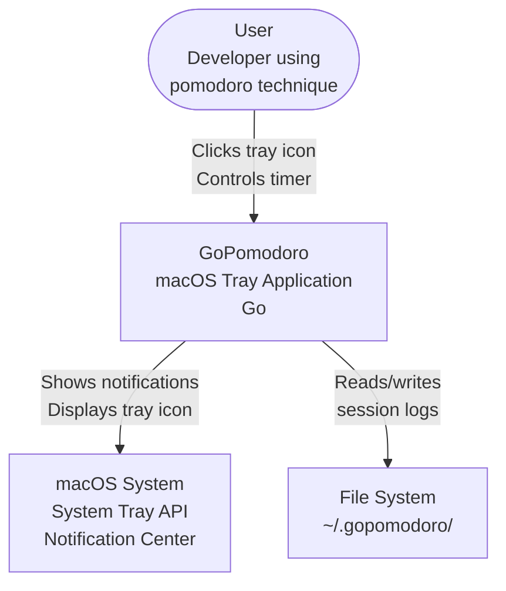
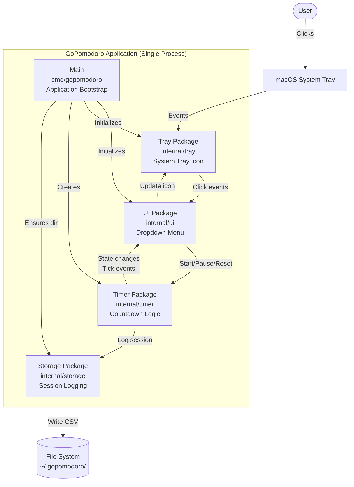
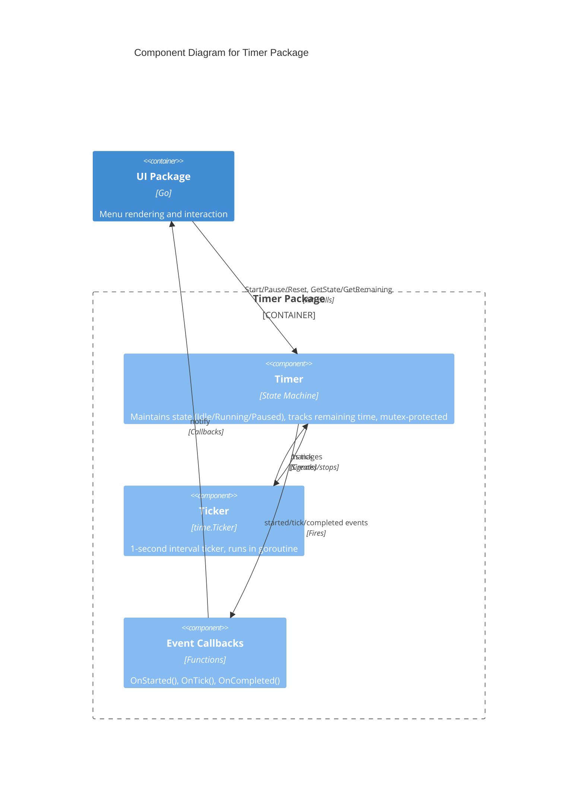
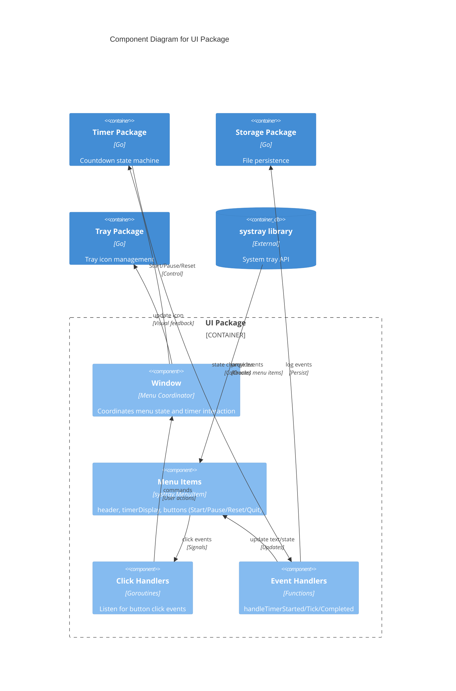
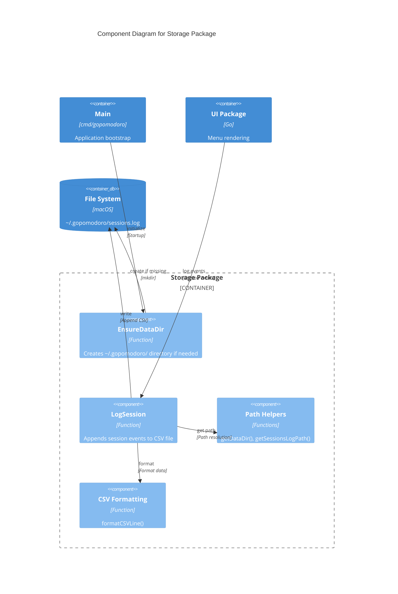

# GoPomodoro Architecture

**Last Updated:** 2025-12-25

## Overview

GoPomodoro is a minimal macOS native pomodoro timer application built in Go. It runs as a system tray application with a dropdown menu interface. The architecture emphasizes simplicity, clear component boundaries, and minimal dependencies.

---

## Architecture Principles

1. **Separation of Concerns** - Timer logic, UI, storage, and system integration are isolated into distinct packages
2. **Event-Driven Communication** - Components communicate through callbacks/events rather than tight coupling
3. **Single Responsibility** - Each package owns one specific aspect of the application
4. **Standard Go Layout** - Follows Go community conventions (`cmd/`, `internal/`)
5. **Minimal Dependencies** - Only essential external libraries; prefer standard library where possible

---

## System Context (C4 Level 1)



**Key External Actors:**
- **User**: Interacts with the tray icon and dropdown menu to control pomodoro sessions
- **macOS System**: Provides system tray integration and notification capabilities  
- **File System**: Stores session logs and configuration in `~/.gopomodoro/`

---

## Container Diagram (C4 Level 2)



**Container Descriptions:**

- **Main (cmd/gopomodoro)**: Application entry point that wires all components together. Initializes storage, creates timer, sets up tray icon and UI, and manages application lifecycle.

- **Tray Package (internal/tray)**: Thin wrapper around `systray` library. Manages system tray icon image and tooltip. Provides interface for click events.

- **UI Package (internal/ui)**: Manages the dropdown menu (systray menu items). Renders timer display, buttons, and state indicators. Translates user clicks into timer commands. Updates UI based on timer events.

- **Timer Package (internal/timer)**: Core countdown logic. Maintains timer state (Idle, Running, Paused). Emits events on state changes (started, tick, completed). Thread-safe state management with mutex.

- **Storage Package (internal/storage)**: Handles file system persistence. Creates and manages `~/.gopomodoro/` directory. Appends session logs to CSV file with timestamp, session type, event, and duration.

---

## Component Diagram: Timer Package (C4 Level 3)



**Timer Component Responsibilities:**

- **Timer (State Machine)**: 
  - Maintains state: `StateIdle`, `StateRunning`, `StatePaused`
  - Tracks remaining time in seconds
  - Thread-safe access via mutex
  - Provides public API: `Start()`, `Pause()`, `Resume()`, `Reset()`
  - Getters: `GetState()`, `GetRemaining()`

- **Ticker**: 
  - Go standard library `time.Ticker` running at 1-second intervals
  - Managed by timer (created on start, stopped on pause/complete)
  - Runs in goroutine when active

- **Event Callbacks**:
  - `OnStarted()`: Fired when timer transitions from Idle to Running
  - `OnTick(remaining int)`: Fired every second with updated remaining time
  - `OnCompleted()`: Fired when timer reaches zero
  - Registered by UI package to update display and log sessions

---

## Component Diagram: UI Package (C4 Level 3)



**UI Component Responsibilities:**

- **Window**: 
  - Coordinates menu state and timer interaction
  - Holds references to all menu items
  - Mediates between timer events and UI updates
  - Triggers storage logging on session events

- **Menu Items** (via systray):
  - `header`: Displays current state ("Ready", "Work Session", "Paused")
  - `timerDisplay`: Shows countdown (e.g., "25:00", "24:37")
  - Buttons: Start, Pause, Reset, Quit
  - Enabled/disabled based on timer state

- **Click Handlers**:
  - Long-running goroutines listening for button click events
  - Translate clicks into timer commands
  - Run for the application lifetime

- **Event Handlers**:
  - Respond to timer state changes
  - Update menu item text and button states
  - Log session starts and completions
  - Update tray icon to reflect current state

---

## Component Diagram: Storage Package (C4 Level 3)



**Storage Component Responsibilities:**

- **EnsureDataDir**: 
  - Creates `~/.gopomodoro/` directory if it doesn't exist
  - Called during application initialization
  - Uses `os.MkdirAll` for idempotent directory creation

- **LogSession**:
  - Appends session events to CSV file
  - Parameters: `timestamp`, `session_type`, `event`, `duration_minutes`
  - Creates file with header if it doesn't exist
  - Thread-safe append operations

- **Path Helpers**:
  - `getDataDir()`: Returns `$HOME/.gopomodoro` or fallback
  - `getSessionsLogPath()`: Returns full path to `sessions.log`
  - Handles `os.UserHomeDir()` errors gracefully

- **CSV Formatting**:
  - Formats session data as CSV line: `timestamp,session_type,event,duration`
  - Uses RFC3339 timestamp format
  - Simple string concatenation (no CSV library needed for append-only)

---

## Data Flow

### Session Start Flow

```
1. User clicks Start button in menu
2. UI Click Handler receives click event
3. UI calls Timer.Start()
4. Timer transitions StateIdle -> StateRunning
5. Timer creates new ticker, starts goroutine
6. Timer fires OnStarted() callback
7. UI EventHandler receives started event
8. UI updates header to "Work Session"
9. UI updates button states (disable Start, enable Pause)
10. UI calls Storage.LogSession("work", "started", 0)
11. Storage appends to sessions.log
12. UI updates tray icon to work state (red tomato)
```

### Timer Tick Flow

```
1. time.Ticker sends signal every 1 second
2. Timer goroutine receives tick
3. Timer decrements remaining time
4. Timer fires OnTick(remaining) callback
5. UI EventHandler receives tick with remaining seconds
6. UI formats time as "MM:SS"
7. UI updates timerDisplay menu item
```

### Session Complete Flow

```
1. Timer reaches 0 seconds remaining
2. Timer stops ticker
3. Timer transitions StateRunning -> StateIdle
4. Timer fires OnCompleted() callback
5. UI EventHandler receives completed event
6. UI calls Storage.LogSession("work", "completed", 25)
7. Storage appends to sessions.log
8. UI updates header to "Ready"
9. UI resets timerDisplay to "25:00"
10. UI updates button states (enable Start, disable Pause)
11. UI updates tray icon to idle state (gray)
```

---

## Technology Choices

### Core Technologies
- **Language**: Go 1.21+
- **System Tray**: `getlantern/systray` library
- **Build**: Go toolchain + Makefile
- **Platform**: macOS (primary), potential for Linux/Windows

### Key Dependencies
```go
require (
    github.com/getlantern/systray v1.2.2
    // Standard library for everything else
)
```

**Rationale** (see [ADR-2025-12-23-go-package-structure-and-testing](docs/adr/ADR-2025-12-23-go-package-structure-and-testing.md)):
- `systray`: Mature, cross-platform tray integration; direct usage keeps code simple
- Standard library: File I/O, logging, time, sync - no additional dependencies needed
- No heavy frameworks or abstractions

### File Format
- **Session Log**: CSV format (`timestamp,session_type,event,duration_minutes`)
- **Rationale**: Human-readable, easy to parse, append-only, no database overhead

---

## Architectural Constraints

### Design Principles
1. **Simplicity over abstraction**: Prefer straightforward solutions; don't build for imaginary futures
2. **Small, safe steps**: Design supports incremental changes without large rewrites
3. **Pragmatic testing**: UI/integration can be tested manually; automated tests focus on core logic
4. **Minimal dependencies**: Avoid unnecessary libraries; keep build simple

### From Current Implementation
1. **Single-process application**: All components run in one Go process
2. **Event-driven UI updates**: Timer communicates via callbacks, not polling
3. **Thread-safe timer**: Mutex-protected state allows concurrent access from UI goroutines
4. **Append-only logging**: No database, no complex queries; simple CSV append

### Platform Constraints
1. **macOS system tray**: Primary target platform; uses macOS tray behavior
2. **File system access**: Requires write access to `$HOME/.gopomodoro/`
3. **Long-running process**: Application runs continuously while user is working

---

## Component Boundaries and Ownership

| Package | Responsibility | Public API | Dependencies |
|---------|---------------|------------|--------------|
| **cmd/gopomodoro** | Application bootstrap | `main()` | All internal packages |
| **internal/timer** | Countdown state machine | `Start()`, `Pause()`, `Reset()`, `GetState()`, `GetRemaining()`, event callbacks | stdlib (sync, time) |
| **internal/ui** | Menu rendering & interaction | `CreateWindow()`, `InitializeMenu()`, `SetTimer()` | timer, storage, tray, systray |
| **internal/tray** | Tray icon management | `Initialize()`, `SetIcon()`, `OnClick()` | systray, stdlib (os) |
| **internal/storage** | File persistence | `EnsureDataDir()`, `LogSession()` | stdlib (os, fmt, time) |

**Dependency Rules:**
- **No circular dependencies**: Enforced by Go's import system
- **`internal/` packages cannot be imported externally**: Protects internal APIs
- **`cmd/` depends on `internal/`**: Main package wires components together
- **Components depend on stdlib and approved libraries**: Minimal external surface area

---

## References

- [CONSTITUTION.md](CONSTITUTION.md) - Project principles and delivery approach
- [PRD.md](PRD.md) - Product requirements and specifications
- [ADR-2025-12-23-go-package-structure-and-testing](docs/adr/ADR-2025-12-23-go-package-structure-and-testing.md) - Package structure and testing decisions
