# Design: Pomodoro Cycle with Breaks and Skip

## Context and Problem

This design extends the Phase 1 functional timer to support the complete pomodoro technique cycle with work sessions, breaks, and cycle tracking.

### Current State

The codebase has (from the [functional-timer-with-session-logging increment](../functional-timer-with-session-logging/increment.md)):
- A working 25-minute countdown timer with start/pause/resume/reset controls
- Session logging to `~/.gopomodoro/sessions.log` in CSV format
- Event-driven architecture: Timer emits events, UI handles them and updates display
- Hardcoded "work" session type with 1500-second (25-minute) duration
- Single-session behavior: timer completes → resets to 25:00 idle state

### Problem

Users need to follow the complete pomodoro technique, which requires:
1. **Multiple session types**: Work (25m), short breaks (5m), long breaks (15m)
2. **Cycle progression**: Track which work session (1-4) the user is on
3. **Automatic transitions**: Know what session comes next after completion
4. **Skip capability**: Advance through sessions early when needed
5. **Visual feedback**: See cycle progress and distinguish session types in the UI

Without these capabilities, users cannot properly follow the pomodoro method. They would need to manually track cycles externally and ignore the app's break functionality.

### References

- [increment.md](increment.md) - Full acceptance criteria and use cases
- [CONSTITUTION.md](../../../CONSTITUTION.md) - Lite mode principles
- [PRD.md](../../../PRD.md) - Complete pomodoro cycle specification
- [ARCHITECTURE.md](../../../ARCHITECTURE.md) - Current component structure
- [Phase 1 design](../functional-timer-with-session-logging/design.md) - Timer and storage foundation

---

## Proposed Solution (Technical Overview)

### High-Level Approach

Transform the Timer from a single-purpose 25-minute countdown into a **session-type-aware timer** that can count down any duration for any session type, while keeping the UI responsible for **cycle orchestration**.

**Key insight**: The Timer doesn't need to know about "session 2 of 4" or "after work comes a break." It just needs to count down whatever duration it's given and report what type of session it's running. The UI, which already orchestrates between Timer and Storage, takes on the additional responsibility of tracking cycle position and determining state transitions.

### Component Changes

**Timer Package** (`internal/timer/`)
- **Becomes configurable**: Accept session type and duration as Start parameters
- **Removes hardcoding**: No more fixed 1500-second default
- **Reports session context**: OnStarted callback includes session type and duration
- **Remains cycle-unaware**: No knowledge of "session N of 4" or what comes next

**UI Package** (`internal/ui/`)
- **Becomes cycle-aware**: Tracks completed work sessions counter (0-4)
- **Orchestrates transitions**: Determines next session type based on current type and cycle position
- **Adds Skip button**: New menu item that stops timer, logs "skipped", advances to next session
- **Adds cycle indicator**: Displays "Session 2/4 🍅🍅○○" visual progress
- **Differentiates states**: Different header text for work/short break/long break

**Tray Package** (`internal/tray/`)
- **Adds icon update method**: Accept session type and state, render appropriate icon
- **Visual differentiation**: Work (🍅 red), short break (☕ green), long break (🌟 blue)

**Storage Package** (`internal/storage/`)
- **No changes needed**: Already supports variable `session_type` parameter in CSV

### Typical Flows

**First work session:**
1. App starts → UI initializes with `currentSessionType = "work"`, `completedWorkSessions = 0`
2. UI displays: "Ready", "25:00", "Session 1/4 🍅○○○"
3. User clicks Start → UI calls `timer.Start("work", 1500)`
4. Timer starts, emits `OnStarted("work", 1500)` → UI logs "work,started,0"
5. Timer ticks down, UI updates display
6. Timer reaches 0, emits `OnCompleted` → UI logs "work,completed,25"
7. UI increments `completedWorkSessions` to 1, sets `currentSessionType = "short_break"`
8. UI displays: "Ready for Break", "05:00", "Session 1/4 🍅○○○"

**Short break to next work:**
1. User clicks Start → UI calls `timer.Start("short_break", 300)`
2. Timer counts down 5 minutes
3. Timer completes → UI logs "short_break,completed,5"
4. UI sets `currentSessionType = "work"`, increments session display to 2
5. UI displays: "Ready", "25:00", "Session 2/4 🍅🍅○○"

**Fourth work session to long break:**
1. User completes work session 4 → UI logs "work,completed,25"
2. UI increments `completedWorkSessions` to 4
3. UI detects 4 completed sessions → sets `currentSessionType = "long_break"`
4. UI displays: "Ready for Long Break", "15:00", "Session 4/4 🍅🍅🍅🍅"

**Long break to cycle reset:**
1. User completes long break → UI logs "long_break,completed,15"
2. UI resets `completedWorkSessions` to 0, sets `currentSessionType = "work"`
3. UI displays: "Ready", "25:00", "Session 1/4 🍅○○○"

**Skip during work session:**
1. User clicks Skip while work session running (12 minutes elapsed)
2. UI calls `timer.Reset()` to stop countdown
3. UI logs "work,skipped,12"
4. UI does NOT increment `completedWorkSessions` (skipped doesn't count)
5. UI determines next session based on position: short break if < 4 sessions, long break if == 4
6. UI transitions to appropriate break ready state

**Skip during break:**
1. User clicks Skip during short break (2 minutes elapsed)
2. UI calls `timer.Reset()` to stop countdown
3. UI logs "short_break,skipped,2"
4. UI increments session display number (cycle indicator advances)
5. UI sets `currentSessionType = "work"`, displays next work session ready state

**Reset from any state:**
1. User clicks Reset
2. UI calls `timer.Reset()`
3. UI does NOT log (incomplete session)
4. UI resets cycle: `completedWorkSessions = 0`, `currentSessionType = "work"`
5. UI displays: "Ready", "25:00", "Session 1/4 🍅○○○"

---

## Scope and Non-Scope (Technical)

### In Scope

This design covers:
- **Session type modeling**: Three types (work, short_break, long_break) with durations (1500s, 300s, 900s)
- **Timer API changes**: `Start(sessionType, duration)` replaces parameterless `Start()`
- **Cycle state tracking**: Completed work sessions counter (0-4) in UI
- **Transition logic**: Determine next session type after completion based on current type and cycle position
- **Skip button**: New menu item that logs "skipped" and advances to next session
- **Cycle indicator**: UI element showing "Session N/4" with visual progress (🍅🍅○○)
- **Header differentiation**: Different text for work/break ready states and running states
- **Tray icon updates**: Different icons for work/short break/long break running states
- **Session type logging**: CSV includes "work", "short_break", or "long_break"
- **Skip behavior distinction**: Skip logs session but doesn't count toward cycle completion
- **Pause during breaks**: Existing pause/resume functionality extended to all session types

### Explicitly Out of Scope

Deferred to future increments:
- **Auto-transitions**: User must manually click Start for each session (breaks and work)
- **Persistent cycle state**: Cycle counter resets on app restart (volatile in-memory state)
- **Notifications**: No alerts when sessions complete
- **Visual themes**: No color-coded backgrounds or UI themes
- **Progress bars**: No time-elapsed or time-remaining visual bars within sessions
- **Configurable durations**: Hardcoded 25/5/15 minute durations (no settings UI)
- **Statistics dashboard**: No pomodoro count, streak tracking, or historical views
- **Reading from sessions.log**: Storage remains write-only

### How This Fits the Roadmap

This increment establishes:
- **The cycle foundation** needed for statistics (which requires understanding what a "complete cycle" means)
- **The session type infrastructure** needed for notifications (which will announce different things for work vs break completions)
- **The state differentiation** needed for visual theming (work state vs break state colors)

Phase 1 gave us the timer engine. This increment gives us the cycle logic. Future increments can add polish (notifications, themes, stats) on top of this foundation.

---

## Architecture and Boundaries

### Updated Component Diagram (C4 Level 2)

```mermaid
graph TB
    User([User])
    macOS[macOS System Tray]
    FS[(File System<br/>~/.gopomodoro/)]
    
    subgraph "GoPomodoro Application (Single Process)"
        Main[Main<br/>cmd/gopomodoro<br/>Application Bootstrap]
        
        UI[UI Package<br/>internal/ui<br/>Dropdown Menu<br/>+ Cycle Orchestration]
        
        Tray[Tray Package<br/>internal/tray<br/>System Tray Icon<br/>+ Icon Updates]
        
        Timer[Timer Package<br/>internal/timer<br/>Countdown Logic<br/>+ Session Type Awareness]
        
        Storage[Storage Package<br/>internal/storage<br/>Session Logging]
    end
    
    User -->|Clicks| macOS
    macOS -->|Events| Tray
    Tray -.->|Click events| UI
    UI -->|Start(type, duration)<br/>Pause/Reset<br/>Skip| Timer
    Timer -.->|OnStarted(type, duration)<br/>OnTick<br/>OnCompleted| UI
    UI -->|UpdateIcon(type, state)| Tray
    Timer -->|Log session<br/>(type, event, duration)| Storage
    Storage -->|Write CSV| FS
    Main -->|Initializes| UI
    Main -->|Initializes| Tray
    Main -->|Creates| Timer
    Main -->|Ensures dir| Storage
    
    style UI fill:#ffe5e5
    style Timer fill:#ffe5e5
    style Tray fill:#ffe5e5
    
    classDef changed fill:#ffe5e5,stroke:#c0392b,stroke-width:2px
    class UI,Timer,Tray changed
```

**Legend**: Components highlighted in red are modified by this increment.

### Component Responsibilities

**Timer Package** (`internal/timer/`) - **MODIFIED**
- Accept session type and duration as Start parameters
- Maintain session context (what type is currently running)
- Emit session type in OnStarted callback
- Remove hardcoded 1500-second default
- Remain cycle-unaware (no knowledge of "session N of 4")
- State machine logic unchanged (idle/running/paused)
- Reset behavior unchanged

**UI Package** (`internal/ui/`) - **MODIFIED**
- **New responsibility: Cycle orchestration**
  - Track completed work sessions (0-4 counter)
  - Track current session type (work, short_break, long_break)
  - Determine next session type after completion
  - Reset cycle after long break completion
- **New UI elements**:
  - Skip button menu item
  - Cycle indicator menu item
- **Extended responsibilities**:
  - Call `timer.Start()` with appropriate session type and duration
  - Handle Skip button clicks (stop timer, log skipped, advance to next session)
  - Update header text based on session type and state
  - Request tray icon updates based on session type
  - Distinguish between completed (increment counter) and skipped (don't increment) work sessions

**Tray Package** (`internal/tray/`) - **MODIFIED**
- **New method**: `UpdateIcon(sessionType string, state timer.State)`
- Render different icon/color based on session type:
  - Work + running: 🍅 red
  - Short break + running: ☕ green
  - Long break + running: 🌟 blue
  - Idle or paused: default gray icon
- Existing click event handling unchanged

**Storage Package** (`internal/storage/`) - **UNCHANGED**
- Already supports variable `sessionType` parameter
- CSV format unchanged: `timestamp,session_type,event,duration_minutes`
- Will receive new session type values: "short_break", "long_break"

**Main Package** (`cmd/gopomodoro/`) - **MINIMAL CHANGES**
- Initialization sequence unchanged
- Component wiring unchanged
- May need to pass Tray reference to UI for icon updates (if not already done)

### Dependency Rules

Following the existing architectural guardrails:

- **Timer** → No dependencies on UI, Storage, or Tray (pure countdown logic)
- **Storage** → No dependencies on Timer, UI, or Tray (pure file I/O)
- **Tray** → No dependencies on Timer, Storage, or UI (pure system integration)
- **UI** → Depends on Timer (calls methods, subscribes to events), Storage (logs sessions), Tray (updates icon)
- **Main** → Depends on all packages (orchestration layer)

No circular dependencies introduced. Dependency flow remains acyclic.

### Guardrails Respected

From [CONSTITUTION.md](../../../CONSTITUTION.md):
- ✅ **Small, safe steps**: Session types before notifications, cycle tracking before statistics
- ✅ **Simple is better than complex**: Cycle tracking in existing UI package, not a new "Cycle Manager"
- ✅ **Make it work, make it right**: Volatile cycle state (in-memory) first, can persist later if needed

From [ADR-2025-12-23-go-package-structure-and-testing.md](../../adr/ADR-2025-12-23-go-package-structure-and-testing.md):
- ✅ **Flat hierarchy**: No new packages added
- ✅ **Component isolation**: Timer changes don't affect Storage, Tray changes don't affect Timer
- ✅ **Minimal dependencies**: No new external libraries

From existing architecture:
- ✅ **Event-driven communication**: Timer → UI callbacks continue
- ✅ **UI as orchestrator**: UI already mediates Timer and Storage, extends naturally to cycle logic
- ✅ **Pure timer logic**: Timer remains stateless regarding application-level concerns (cycles, history)

---

## Contracts and Data

### Timer Package API Changes

**Modified API:**

```go
package timer

import (
    "sync"
    "time"
)

// State represents the current state of the timer (unchanged)
type State int

const (
    StateIdle State = iota
    StateRunning
    StatePaused
    
    tickInterval = 1 * time.Second
)

// Timer manages a countdown timer for any session type
type Timer struct {
    mu            sync.Mutex
    state         State
    remaining     int
    sessionType   string  // NEW: tracks current session type
    ticker        *time.Ticker
    stopChan      chan bool
    onStarted     func(string, int)  // CHANGED: callback signature
    onTick        func(int)
    onCompleted   func()
}

// New creates a timer initialized to idle state with no default duration
func New() *Timer {
    return &Timer{
        state:    StateIdle,
        remaining: 0,  // CHANGED: no default
        stopChan: make(chan bool, 1),
    }
}

// GetState returns the current state (unchanged)
func (t *Timer) GetState() State

// GetRemaining returns the remaining time in seconds (unchanged)
func (t *Timer) GetRemaining() int

// GetSessionType returns the current session type
// Returns empty string if idle
func (t *Timer) GetSessionType() string  // NEW

// OnStarted registers a callback for timer start events
// Callback receives sessionType and durationSeconds
func (t *Timer) OnStarted(handler func(sessionType string, durationSeconds int))  // CHANGED

// OnTick registers a callback for each timer tick (unchanged)
func (t *Timer) OnTick(handler func(remainingSeconds int))

// OnCompleted registers a callback for timer completion (unchanged)
func (t *Timer) OnCompleted(handler func())

// Start begins countdown for the given session type and duration
// Parameters:
//   sessionType: "work", "short_break", or "long_break"
//   durationSeconds: countdown duration (1500 for work, 300 for short break, 900 for long break)
// Transitions: idle → running
// Emits: OnStarted(sessionType, durationSeconds)
func (t *Timer) Start(sessionType string, durationSeconds int)  // CHANGED

// Pause stops the countdown, preserving remaining time (unchanged)
func (t *Timer) Pause()

// Resume continues countdown from paused time (unchanged)
func (t *Timer) Resume()

// Reset stops timer and clears session type
// Transitions: any → idle
// Sets remaining to 0, sessionType to ""
func (t *Timer) Reset()  // BEHAVIOR CHANGED
```

**Behavioral contract changes:**

| Method | Before | After |
|--------|--------|-------|
| `Start()` | Parameterless, hardcoded 1500s | `Start(sessionType string, durationSeconds int)` |
| `OnStarted` callback | `func()` | `func(sessionType string, durationSeconds int)` |
| `Reset()` | Sets remaining to 1500 | Sets remaining to 0, clears sessionType |
| `GetSessionType()` | N/A | Returns current session type or "" |

**Compatibility notes:**
- This is a breaking API change to an internal package (acceptable)
- All callers of `timer.Start()` must be updated to pass session type and duration
- All `OnStarted` callback handlers must accept the new parameters

### UI Package State Changes

**New state fields:**

```go
type Window struct {
    // Existing fields (unchanged)
    visible      bool
    header       *systray.MenuItem
    timerDisplay *systray.MenuItem
    btnStart     *systray.MenuItem
    btnPause     *systray.MenuItem
    btnReset     *systray.MenuItem
    btnQuit      *systray.MenuItem
    timer        *timer.Timer
    
    // NEW: Cycle tracking state
    currentSessionType    string  // "work", "short_break", or "long_break"
    completedWorkSessions int     // 0-4, counts only completed (not skipped) work sessions
    
    // NEW: UI elements
    btnSkip         *systray.MenuItem
    cycleIndicator  *systray.MenuItem
    
    // NEW: Reference to tray for icon updates
    tray *tray.Tray
}
```

**Session type durations (constants):**

```go
const (
    sessionTypeWork       = "work"
    sessionTypeShortBreak = "short_break"
    sessionTypeLongBreak  = "long_break"
    
    durationWork       = 1500  // 25 minutes in seconds
    durationShortBreak = 300   // 5 minutes in seconds
    durationLongBreak  = 900   // 15 minutes in seconds
)
```

**Transition logic:**

```go
// Pseudo-code for determining next session type after completion
func (w *Window) determineNextSessionType() string {
    switch w.currentSessionType {
    case sessionTypeWork:
        // Work completed: check if 4th session
        if w.completedWorkSessions >= 4 {
            return sessionTypeLongBreak
        }
        return sessionTypeShortBreak
        
    case sessionTypeShortBreak:
        return sessionTypeWork
        
    case sessionTypeLongBreak:
        // Reset cycle after long break
        w.completedWorkSessions = 0
        return sessionTypeWork
    }
}
```

### Tray Package API Addition

**New method:**

```go
package tray

import "github.com/co0p/gopomodoro/internal/timer"

// UpdateIcon updates the tray icon based on session type and timer state
// Parameters:
//   sessionType: "work", "short_break", or "long_break"
//   state: timer.StateIdle, timer.StateRunning, or timer.StatePaused
func (t *Tray) UpdateIcon(sessionType string, state timer.State) {
    // Implementation determines icon/color based on combination:
    // - work + running → red tomato 🍅
    // - short_break + running → green coffee ☕
    // - long_break + running → blue star 🌟
    // - idle or paused → default gray icon
}
```

### Storage Package (Unchanged)

**Existing API** (no changes needed):

```go
// LogSession appends a session record to sessions.log
// CSV format: timestamp,session_type,event,duration_minutes
func LogSession(timestamp time.Time, sessionType, event string, durationMinutes int) error
```

**Session type values** (extended usage):

| Session Type | Event Types | Duration (completed) |
|--------------|-------------|---------------------|
| `work` | started, completed, skipped | 25 minutes (or elapsed if skipped) |
| `short_break` | started, completed, skipped | 5 minutes (or elapsed if skipped) |
| `long_break` | started, completed, skipped | 15 minutes (or elapsed if skipped) |

**Example CSV entries:**

```csv
timestamp,session_type,event,duration_minutes
2025-12-25T10:00:00Z,work,started,0
2025-12-25T10:25:00Z,work,completed,25
2025-12-25T10:25:00Z,short_break,started,0
2025-12-25T10:30:00Z,short_break,completed,5
2025-12-25T10:30:00Z,work,started,0
2025-12-25T10:42:00Z,work,skipped,12
2025-12-25T10:42:00Z,short_break,started,0
```

---

## Testing and Safety Net

### Unit Testing Strategy

Given the **lite constitution mode**, focus testing on core logic where bugs would cause real problems. Manual testing is acceptable for UI and integration flows.

**Timer Package Tests** (`internal/timer/timer_test.go`)

Core behaviors to test:
- **Start with session type and duration**
  - Start("work", 1500) sets remaining to 1500, state to running, sessionType to "work"
  - Start("short_break", 300) sets remaining to 300, state to running, sessionType to "short_break"
  - Start("long_break", 900) sets remaining to 900, state to running, sessionType to "long_break"
  
- **OnStarted callback receives session context**
  - Callback invoked with correct sessionType and durationSeconds
  - Verify for all three session types
  
- **GetSessionType returns current session**
  - Returns correct type when running
  - Returns empty string when idle or after reset
  
- **Countdown works for different durations**
  - Short duration (e.g., 5 seconds) counts down correctly
  - OnCompleted fires at zero regardless of starting duration
  
- **Reset clears session type**
  - After Start("work", 1500) then Reset(), sessionType is ""
  - Remaining is 0 (not 1500)

**UI Cycle Logic Testing** (manual, given lite mode)

Manual verification flows:
- **Full cycle walkthrough**: Start work session 1 → complete → start short break → complete → verify session 2/4 displayed → repeat for sessions 3 and 4 → complete session 4 → verify long break appears → complete long break → verify cycle resets to session 1/4
  
- **Skip during work session**: Start work → wait 5 minutes → click Skip → verify "work,skipped,5" logged → verify completedWorkSessions NOT incremented → verify transitions to appropriate break
  
- **Skip during break**: Start short break → wait 2 minutes → click Skip → verify "short_break,skipped,2" logged → verify transitions to next work session → verify session number advances in indicator
  
- **Reset from various states**: Reset during work → verify returns to session 1/4 work ready state → Reset during short break → verify returns to session 1/4 → Reset during long break → verify returns to session 1/4
  
- **Pause during breaks**: Start short break → click Pause → verify timer stops → verify header shows "Paused" → click Start/Resume → verify countdown continues → complete break → verify transitions correctly

**Tray Icon Updates** (manual)

Visual verification:
- Start work session → verify tray icon shows red/work state
- Start short break → verify tray icon shows green/break state
- Start long break → verify tray icon shows blue/long break state
- Pause any session → verify tray icon shows paused/gray state
- Complete session → verify tray icon returns to idle state

### Integration Testing

**Session Log Integrity** (manual verification)

After manual testing flows, inspect `~/.gopomodoro/sessions.log`:
- Verify all three session types appear: work, short_break, long_break
- Verify skipped sessions log with correct elapsed minutes
- Verify completed sessions log with full duration
- Verify timestamp format remains ISO 8601
- Verify CSV structure is valid (no malformed lines)

**Regression Checks**

Ensure Phase 1 functionality still works:
- **Basic work session**: Start 25-minute work session → pause → resume → complete → verify logs "work,started,0" and "work,completed,25"
- **Reset behavior**: Start work → reset → verify no log entry for incomplete session
- **Button states**: Verify Start disabled when running, Pause disabled when idle, etc.

### Test Data and Fixtures

**No complex fixtures needed** (per lite mode). Tests use:
- Short durations for faster test execution (e.g., 3-second countdown instead of 1500 seconds)
- Inline test data (session types as string literals)
- Temporary directories for storage tests (already established in Phase 1)

### Potential Issues and Mitigations

**Risk: Cycle counter out of sync**
- Symptom: Session indicator shows 3/4 but long break appears
- Test: Complete 4 work sessions in sequence, verify long break appears after 4th, not 3rd
- Mitigation: Unit test the determineNextSessionType logic explicitly

**Risk: Skip doesn't advance to correct session**
- Symptom: Skip during work session 2 transitions to work instead of break
- Test: Skip from each session type, verify correct next session
- Mitigation: Manual walkthrough of skip scenarios from each position

**Risk: Timer API change breaks existing UI**
- Symptom: Compile errors or runtime panics in UI package
- Test: Compilation succeeds, app initializes without crashing
- Mitigation: Update all timer.Start() call sites before testing

---

## CI/CD and Rollout

### Build and Test Pipeline

**Current state**: No CI infrastructure (manual testing per lite constitution)

**This increment**:
- `make test` runs timer package unit tests (new tests for session types)
- `make build` compiles single binary with no new dependencies
- Manual testing checklist covers cycle flows and skip scenarios

**No changes needed** to build tooling or commands.

### Deployment

**Single binary deployment** (unchanged from Phase 1):
1. Build binary: `make build` produces `bin/gopomodoro`
2. Replace existing binary on target machine
3. Restart app

**No migration or setup steps** required:
- Existing `~/.gopomodoro/sessions.log` remains compatible
- No schema changes to CSV format (session_type column already exists)
- Cycle state is volatile (starts fresh on every app launch)

### Rollout Strategy

**For single-developer tool**:
- Replace binary on local machine
- Test with real usage over a few pomodoro cycles
- Monitor session log for correct entries

**If distributing to others** (future):
- Could use feature flag for new cycle logic, but not necessary for initial rollout
- Cycle behavior is self-contained and doesn't affect existing work session functionality

### Rollback and Rollback Plan

**How to rollback**:
1. Stop app
2. Replace binary with previous Phase 1 version
3. Restart app

**Safe to rollback because**:
- Session log format is backward compatible (old version ignores short_break/long_break entries)
- No persistent cycle state to corrupt
- No database migrations or schema changes

**Disable without rollback**:
- Not applicable (no feature flags in this design)
- If cycle logic has bugs, full rollback is the mitigation

**Detection of issues**:
- Session log has incorrect session types or durations
- Tray icon doesn't update
- Skip button doesn't appear or doesn't work
- Cycle indicator shows wrong session number

---

## Observability and Operations

### Logging

**Session log entries** (primary observability mechanism):

The existing `storage.LogSession()` already provides audit trail. This increment extends it with:

**New session types logged**:
- `short_break` - 5-minute break sessions
- `long_break` - 15-minute break sessions

**New event type logged**:
- `skipped` - session ended early via Skip button

**Log entry context**:
- Timestamp: ISO 8601 UTC timestamp (unchanged)
- Session type: work, short_break, or long_break
- Event: started, completed, or skipped
- Duration: minutes elapsed (0 for started, full duration for completed, partial for skipped)

**Example log sequence** (one full cycle):

```csv
2025-12-25T09:00:00Z,work,started,0
2025-12-25T09:25:00Z,work,completed,25
2025-12-25T09:25:00Z,short_break,started,0
2025-12-25T09:30:00Z,short_break,completed,5
2025-12-25T09:30:00Z,work,started,0
2025-12-25T09:55:00Z,work,completed,25
2025-12-25T09:55:00Z,short_break,started,0
2025-12-25T09:57:00Z,short_break,skipped,2
2025-12-25T09:57:00Z,work,started,0
2025-12-25T10:22:00Z,work,completed,25
2025-12-25T10:22:00Z,short_break,started,0
2025-12-25T10:27:00Z,short_break,completed,5
2025-12-25T10:27:00Z,work,started,0
2025-12-25T10:52:00Z,work,completed,25
2025-12-25T10:52:00Z,long_break,started,0
2025-12-25T11:07:00Z,long_break,completed,15
```

**What you can diagnose from logs**:
- Whether user is completing full cycles or skipping frequently
- Average session durations (if analyzing skipped entries)
- Cycle completion rate (4 work sessions + long break)
- Usage patterns (time of day, frequency)

### Metrics

**No application metrics** in this increment (per lite constitution and non-goals).

**Manual observation** via:
- Session log file growth and content
- Visual inspection of tray icon states during usage

**Future consideration**: If statistics increment is implemented, could derive metrics from session log (total pomodoros, skip rate, etc.).

### Visual Feedback (Operator Observability)

**At-a-glance status** visible without opening dropdown:

| Tray Icon | Meaning |
|-----------|---------|
| 🍅 Red | Work session in progress |
| ☕ Green | Short break in progress |
| 🌟 Blue | Long break in progress |
| ○ Gray | Idle or paused |

**Dropdown provides detailed state**:
- Header: Current session type or ready state
- Timer display: Countdown value
- Cycle indicator: "Session N/4 🍅🍅○○" shows progress through cycle

**What operators (users) can observe**:
- Current session type at a glance (tray icon color)
- How far through the current cycle (cycle indicator)
- Whether timer is running or paused (icon + header)
- Exact time remaining (timer display)

### Error Handling

**Storage errors** (from Phase 1, unchanged):
- If `storage.LogSession()` fails, app logs error and continues
- No retry logic (fail-fast for session logging)
- Error visible in terminal/console output

**New potential errors**:
- Invalid session type passed to `timer.Start()` - mitigated by using constants
- Cycle counter overflow (completedWorkSessions > 4) - mitigated by reset logic after long break

**Error visibility**:
- Console/terminal output for storage errors
- Invalid state visible in UI (e.g., wrong session type displayed)
- Session log can be manually inspected for anomalies

### Operational Considerations

**Memory footprint**:
- Minimal increase (two string fields + one int counter in UI struct)
- No caching or large data structures

**File system usage**:
- Session log grows slightly faster (more session types logged)
- Still append-only, no rotation or cleanup in this increment

**App restart behavior**:
- Cycle state resets to session 1/4 on restart (volatile)
- This is expected behavior (no persistence in this increment)
- Session log preserves history across restarts

---

## Risks, Trade-offs, and Alternatives

### Known Risks

**1. Volatile cycle state (no persistence)**

**Risk**: If app crashes or is restarted, user loses cycle progress (e.g., was on session 3/4, restarts to 1/4).

**Impact**: Moderate annoyance for users; doesn't lose completed session data (logged), but psychological "streak" is broken.

**Mitigation options**:
- Accept for MVP (aligns with lite mode - simple first)
- Future increment: Persist cycle state to `~/.gopomodoro/state.json`
- Workaround: Users can deduce cycle position from recent session log entries

**Decision**: Accept risk for this increment. Persistence can be added if users request it.

**2. Timer API breaking change**

**Risk**: `timer.Start()` signature change requires updates to all call sites.

**Impact**: Low (internal API only, single codebase, will catch at compile time).

**Mitigation**: Update UI package's handleStartClick before testing.

**Decision**: Acceptable breaking change.

**3. Skip vs Reset user confusion**

**Risk**: Users may not understand difference between Skip (advance to next session) and Reset (return to start of cycle).

**Impact**: Moderate (users might click wrong button, disrupting their flow).

**Mitigation options**:
- Clear button labels: "Skip →" vs "Reset ↺"
- Tooltips explaining behavior (systray may support this)
- User education in documentation

**Decision**: Use clear labels and tooltips; can iterate based on feedback.

**4. Cycle logic bugs**

**Risk**: Edge cases in transition logic (e.g., skip on 4th work session, reset during long break) could cause incorrect next session type.

**Impact**: High (breaks core functionality).

**Mitigation**: Manual testing of all transition scenarios; unit test determineNextSessionType logic.

**Decision**: Thorough manual testing required before deployment.

### Trade-offs Made

**Cycle tracking in UI vs separate Cycle Manager package**

**Choice**: Cycle tracking lives in UI package.

**Pros**:
- Simpler architecture (no new package)
- UI already orchestrates Timer and Storage
- Fewer files and interfaces

**Cons**:
- UI package becomes slightly more complex
- Cycle logic mixed with UI concerns

**Rationale**: Constitution principle "simple is better than complex." Adding a Cycle Manager would be premature abstraction for ~50 lines of state management.

**When to revisit**: If cycle logic grows beyond simple state tracking (e.g., cycle history, complex rules), extract to separate package.

---

**Volatile cycle state vs persistence**

**Choice**: Cycle state is in-memory only (resets on restart).

**Pros**:
- Simpler implementation (no file I/O on every completion)
- No state file corruption risk
- Faster (no disk writes for cycle updates)

**Cons**:
- User loses cycle position on restart
- Can't resume mid-cycle after crash

**Rationale**: Lite mode favors "make it work" first. Persistence adds complexity (file writes, error handling, state validation). Can add later if users need it.

**When to revisit**: If users report frustration with losing cycle state, or if implementing statistics (which might naturally lead to persisting more state).

---

**Manual transitions vs auto-start next session**

**Choice**: User must click Start for each session (breaks and work).

**Pros**:
- User maintains control (can delay breaks or work)
- Simpler implementation (no auto-transition timers)
- Aligns with increment non-goals

**Cons**:
- More clicks required
- Easy to forget to start break
- Less automated than some pomodoro apps

**Rationale**: Increment explicitly scoped this out. Auto-transitions add complexity (background timers, notification integration). Better as future enhancement once notifications exist.

**When to revisit**: After notifications increment, could add auto-start as optional behavior.

### Alternatives Considered

**Alternative 1: Session type as enum in Timer**

**Approach**: Define `type SessionType int` with constants in Timer package.

**Rejected because**:
- Couples Timer to application-level session concepts
- String-based session types already work for logging
- Enum doesn't provide type safety across package boundaries (still need validation)

**Alternative 2: Separate Cycle state machine**

**Approach**: Create `internal/cycle/` package with its own state machine for cycle logic.

**Rejected because**:
- Over-engineered for current needs
- Adds abstraction layer without clear benefit
- UI already coordinates Timer and Storage; cycle fits naturally there

**Might reconsider if**: Cycle logic becomes complex (e.g., custom cycle lengths, cycle history, advanced rules).

**Alternative 3: Persistent cycle state in CSV**

**Approach**: Add `cycle_position` column to session log, reconstruct state on startup.

**Rejected because**:
- Mixes transient state (cycle position) with event log (sessions)
- Complicates log parsing and interpretation
- If persisting, better to use separate state file

**Might reconsider if**: Implementing undo/redo for sessions or detailed session history features.

---

## Follow-up Work

### Immediate Next Increments (Suggested)

**1. Session completion notifications**
- **What**: macOS notifications when sessions complete
- **Why**: Users need alerts to know when to take breaks or resume work
- **Builds on**: Session type differentiation (different notifications for work vs breaks)

**2. Auto-transitions between sessions**
- **What**: Automatically start next session after completion (with option to delay)
- **Why**: Reduces manual clicks, improves flow
- **Requires**: Notifications (to alert user when auto-transition happens)

**3. Statistics dashboard**
- **What**: Menu item showing completed pomodoros, current streak, daily/weekly totals
- **Why**: Provides motivation and progress tracking
- **Builds on**: Session log and cycle completion events

### Future Enhancements

**Persistent cycle state**
- Save cycle position to `~/.gopomodoro/state.json`
- Resume mid-cycle after app restart
- Useful if users report frustration with volatile state

**Visual themes and colors**
- Color-coded dropdown backgrounds (red for work, green for breaks)
- Matches PRD specification for light/dark mode
- Enhances visual distinction between session types

**Configurable durations**
- Settings UI or JSON config for custom work/break lengths
- Support different pomodoro variants (e.g., 50/10 instead of 25/5)
- Requires settings management infrastructure

**Progress bar within session**
- Visual indicator of time elapsed vs remaining
- More engaging than static countdown number
- Low priority (countdown display is sufficient)

### Technical Debt and Cleanup

**After this increment, consider**:

**Refactor UI package size**
- If UI grows beyond ~300-400 lines, consider splitting:
  - `internal/ui/menu.go` - Menu item management
  - `internal/ui/cycle.go` - Cycle orchestration logic
  - `internal/ui/handlers.go` - Event handlers
- Not urgent for current scope

**Test coverage improvement**
- Add unit tests for UI cycle transition logic if bugs are found
- Currently manual testing is acceptable per lite mode
- Revisit if releasing to wider audience

**Icon asset management**
- Tray icon states currently hardcoded
- If adding more states or animations, consider icon asset loading system
- Not needed for three static states

---

## References

- [increment.md](increment.md) - Acceptance criteria and use cases
- [CONSTITUTION.md](../../../CONSTITUTION.md) - Lite mode principles and guardrails
- [PRD.md](../../../PRD.md) - Complete product vision and pomodoro cycle specification
- [ARCHITECTURE.md](../../../ARCHITECTURE.md) - Current system architecture
- [Phase 1 Design](../functional-timer-with-session-logging/design.md) - Timer and storage foundation
- [ADR-2025-12-23-go-package-structure-and-testing.md](../../adr/ADR-2025-12-23-go-package-structure-and-testing.md) - Package structure conventions

---

## Machine-Readable Artifacts

### API Contracts

#### Timer Package Public API (Modified)

```go
// File: internal/timer/timer.go
package timer

import (
    "sync"
    "time"
)

// State represents the current state of the timer
type State int

const (
    StateIdle State = iota
    StateRunning
    StatePaused
)

// Timer manages a countdown timer for any session type
type Timer struct {
    mu            sync.Mutex
    state         State
    remaining     int
    sessionType   string
    ticker        *time.Ticker
    stopChan      chan bool
    onStarted     func(string, int)
    onTick        func(int)
    onCompleted   func()
}

// New creates a new Timer initialized to idle state
func New() *Timer

// Start begins countdown for the given session type and duration
// sessionType: "work", "short_break", or "long_break"
// durationSeconds: countdown duration in seconds
func (t *Timer) Start(sessionType string, durationSeconds int)

// Pause pauses the running timer
func (t *Timer) Pause()

// Resume resumes a paused timer
func (t *Timer) Resume()

// Reset stops the timer and clears session state
func (t *Timer) Reset()

// GetState returns the current timer state
func (t *Timer) GetState() State

// GetRemaining returns remaining time in seconds
func (t *Timer) GetRemaining() int

// GetSessionType returns the current session type or empty string if idle
func (t *Timer) GetSessionType() string

// OnStarted registers a callback for timer start events
// Callback receives sessionType and durationSeconds
func (t *Timer) OnStarted(handler func(sessionType string, durationSeconds int))

// OnTick registers a callback for each timer tick
// Callback receives remaining seconds
func (t *Timer) OnTick(handler func(remainingSeconds int))

// OnCompleted registers a callback for timer completion
func (t *Timer) OnCompleted(handler func())
```

#### Tray Package Public API (Modified)

```go
// File: internal/tray/tray.go (addition)
package tray

import "github.com/co0p/gopomodoro/internal/timer"

// UpdateIcon updates the tray icon based on session type and timer state
// sessionType: "work", "short_break", "long_break", or ""
// state: timer.StateIdle, timer.StateRunning, or timer.StatePaused
func (t *Tray) UpdateIcon(sessionType string, state timer.State)
```

#### UI Package Internal Constants

```go
// File: internal/ui/window.go (additions)
package ui

const (
    // Session type identifiers
    sessionTypeWork       = "work"
    sessionTypeShortBreak = "short_break"
    sessionTypeLongBreak  = "long_break"
    
    // Session durations in seconds
    durationWork       = 1500  // 25 minutes
    durationShortBreak = 300   // 5 minutes
    durationLongBreak  = 900   // 15 minutes
    
    // Cycle configuration
    sessionsPerCycle = 4
)
```

### Architecture Diagrams

#### C4 Component Diagram: UI Package (Level 3)

Updated to show cycle orchestration:


#### State Transition Diagram: Cycle Progression


#### Data Flow Diagram: Skip Operation

```mermaid
sequenceDiagram
    participant User
    participant UI as UI Package
    participant Timer as Timer Package
    participant Storage as Storage Package
    participant Tray as Tray Package
    
    Note over User,Tray: User skips during work session (12 minutes elapsed)
    
    User->>UI: Click Skip button
    UI->>Timer: Reset()
    Timer->>Timer: Stop ticker, state → idle
    Timer-->>UI: (operation complete)
    
    UI->>UI: Calculate elapsed: 25 - remaining = 12 minutes
    UI->>Storage: LogSession("work", "skipped", 12)
    Storage->>Storage: Append to sessions.log
    
    UI->>UI: Determine next session type<br/>(work → short_break if < 4 sessions)
    Note over UI: Do NOT increment completedWorkSessions
    
    UI->>UI: Update state:<br/>currentSessionType = "short_break"
    UI->>UI: Update display:<br/>"Ready for Break", "05:00"
    UI->>Tray: UpdateIcon("", StateIdle)
    Tray->>Tray: Set idle icon
    
    Note over User,Tray: Ready for short break (cycle position unchanged)
```



### CSV Log Schema

#### sessions.log Format

```csv
timestamp,session_type,event,duration_minutes
```

**Column specifications:**

| Column | Type | Format | Values | Description |
|--------|------|--------|--------|-------------|
| `timestamp` | ISO 8601 datetime | `YYYY-MM-DDTHH:MM:SSZ` | UTC timestamp | When event occurred |
| `session_type` | String | lowercase | `work`, `short_break`, `long_break` | Type of session |
| `event` | String | lowercase | `started`, `completed`, `skipped` | Event type |
| `duration_minutes` | Integer | decimal | 0, 5, 15, 25, or partial | Minutes for event |

**Duration semantics:**

| Event | Duration Value |
|-------|---------------|
| `started` | Always `0` |
| `completed` | Full session duration (25 for work, 5 for short_break, 15 for long_break) |
| `skipped` | Elapsed minutes (e.g., 12 if user skipped at 12 minutes into 25-minute work session) |

**Example log entries:**

```csv
timestamp,session_type,event,duration_minutes
2025-12-25T14:00:00Z,work,started,0
2025-12-25T14:25:00Z,work,completed,25
2025-12-25T14:25:00Z,short_break,started,0
2025-12-25T14:30:00Z,short_break,completed,5
2025-12-25T14:30:00Z,work,started,0
2025-12-25T14:42:00Z,work,skipped,12
2025-12-25T14:42:00Z,short_break,started,0
2025-12-25T14:47:00Z,short_break,completed,5
2025-12-25T14:47:00Z,work,started,0
2025-12-25T15:12:00Z,work,completed,25
2025-12-25T15:12:00Z,short_break,started,0
2025-12-25T15:17:00Z,short_break,completed,5
2025-12-25T15:17:00Z,work,started,0
2025-12-25T15:42:00Z,work,completed,25
2025-12-25T15:42:00Z,long_break,started,0
2025-12-25T15:57:00Z,long_break,completed,15
```
