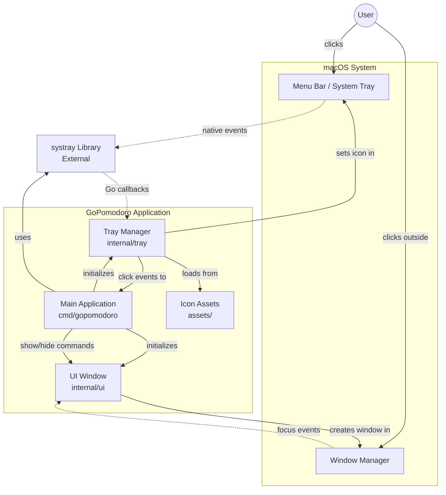
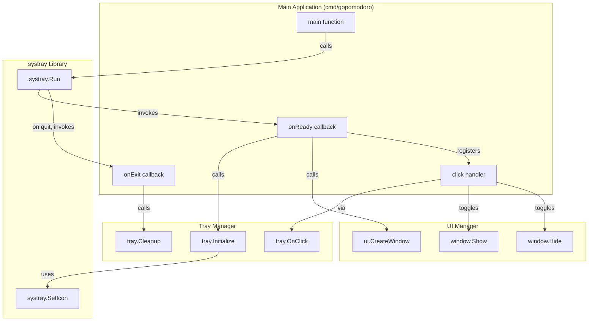

# Design: Tray Icon and Dropdown UI

## Context and Problem

This design addresses the first increment of GoPomodoro: establishing the foundational macOS system tray application with a clickable icon and dropdown UI panel.

### Current State
The project is starting from zero code. We have a detailed PRD and a lite constitution that emphasizes small, safe steps and simplicity over complexity.

### Problem to Solve
Users need to be able to:
- Launch GoPomodoro and see it running in the macOS menu bar
- Click the tray icon to open a dropdown panel
- See the structure of the future timer interface (placeholder UI)
- Close the dropdown naturally (click outside or click icon again)

This increment validates our architectural choices (Go + macOS tray integration) before we invest in timer logic, notifications, or persistence.

### Why Now
Following the constitution's "small, safe steps" principle, we're separating UI structure from business logic. Getting the tray integration and basic UI working first allows us to:
- Validate the framework choice (getlantern/systray)
- Establish project structure and build tooling
- Create a visible, testable foundation for future increments

### Related Documents
- [increment.md](increment.md) — Product-level WHAT for this increment
- [CONSTITUTION.md](../../CONSTITUTION.md) — Project values and principles (lite mode)
- [PRD.md](../../PRD.md) — Full product requirements

## Proposed Solution (Technical Overview)

### High-Level Approach

Build a minimal Go application using the `getlantern/systray` library for macOS menu bar integration. The application will:

1. Initialize as a background-only macOS app (no dock icon)
2. Display a system tray icon in idle state (gray circle)
3. Show a dropdown window/panel when the icon is clicked
4. Display placeholder UI elements (header, timer display, buttons)
5. Hide the window when the user clicks outside or re-clicks the icon

### Component Architecture

The system consists of three main components:

**Main Application** (`cmd/gopomodoro/main.go`)
- Application entry point
- Configures macOS app behavior (LSUIElement flag to suppress dock icon)
- Initializes the systray library
- Wires together tray and UI components

**Tray Manager** (`internal/tray/`)
- Wraps the systray library
- Manages tray icon lifecycle (initialize, set icon image, cleanup)
- Handles click events
- Provides simple interface to the rest of the application

**UI Window** (`internal/ui/`)
- Creates and manages the dropdown window/panel
- Positions window below tray icon
- Renders placeholder UI layout (header, timer display, buttons)
- Handles window show/hide behavior
- Auto-hides on focus loss

### Data Flow

```
User launches app
    ↓
main.go initializes
    ↓
systray.Run() starts event loop
    ↓
Tray icon appears in menu bar
    ↓
User clicks icon → Event to tray manager
    ↓
Tray manager signals UI window
    ↓
UI window shows at calculated position
    ↓
User clicks outside → Window loses focus
    ↓
Window auto-hides
```

### Build and Development Workflow

A Makefile provides standard commands for development:
- Building the binary
- Running the application
- Running tests
- Cleaning build artifacts
- Managing dependencies

This ensures consistent build behavior and makes it easy to integrate with CI later if needed.

## Scope and Non-Scope (Technical)

### In-Scope for This Design

**Infrastructure:**
- Go module setup (go.mod)
- Project directory structure (cmd/, internal/, assets/)
- Makefile for build automation

**Tray Icon:**
- Initialize systray library
- Load and set icon image (gray/idle state)
- Handle left-click events
- Suppress dock icon (LSUIElement)

**Dropdown Window:**
- Create native macOS window or use systray menu as fallback
- Position window below tray icon
- Display structured layout with placeholder text/buttons
- Handle window visibility (show/hide)
- Auto-hide on focus loss or re-click

**Placeholder UI Elements:**
- Header label ("Ready" or "Idle")
- Timer display area (showing "25:00" as placeholder)
- Three buttons: Start, Pause, Reset (non-functional, visual only)

**Testing and Tooling:**
- Basic unit tests for tray and ui package initialization
- Manual testing workflow
- Make targets for build/test/run

### Explicitly Out-of-Scope

**Not in This Increment:**
- Timer countdown logic or state management
- Functional button click handlers
- Pomodoro cycle logic
- Notifications
- Settings or configuration files
- Persistence (~/.gopomodoro/ directory)
- Session tracking or statistics
- Color-coded states (work/break modes)
- Full visual polish (final colors, animations)
- Cross-platform support (Linux, Windows)
- App bundling or distribution

**Deferred to Later:**
- ADR documenting framework choice (should be created alongside this increment)
- More sophisticated window positioning algorithms
- Keyboard shortcuts or right-click menus

## Architecture and Boundaries

### Component Structure

```
gopomodoro/
├── cmd/
│   └── gopomodoro/
│       └── main.go              # Application entry point
├── internal/
│   ├── tray/
│   │   └── tray.go              # Tray icon management
│   └── ui/
│       └── window.go            # Dropdown window/panel
├── assets/
│   └── icon-idle.png            # Tray icon image (gray circle)
├── Makefile                     # Build automation
├── go.mod                       # Go module definition
├── go.sum                       # Dependency checksums
└── README.md                    # Updated with build instructions
```

### Component Responsibilities

**cmd/gopomodoro/main.go**
- Bootstrap the application
- Set macOS-specific app properties (LSUIElement to hide dock icon)
- Call `systray.Run()` with initialization and cleanup callbacks
- Wire tray manager and UI window together
- Handle graceful shutdown

**internal/tray/tray.go**
- Initialize systray library
- Load icon image from assets/
- Set the tray icon
- Register click handler callback
- Provide simple API: `Initialize()`, `SetIcon()`, `OnClick()`
- Clean up on application exit

**internal/ui/window.go**
- Create macOS window (native NSWindow via CGo or simpler fallback)
- Calculate position below tray icon (get tray icon screen coordinates)
- Build placeholder UI layout (labels, buttons)
- Show/hide window on demand
- Implement focus loss detection (close when clicking outside)
- Provide API: `CreateWindow()`, `Show()`, `Hide()`

**assets/icon-idle.png**
- Simple PNG image (16x16 or 32x32 for Retina)
- Gray circle (○) representing idle state
- Embedded in binary or loaded at runtime

**Makefile**
- Defines standard targets: build, test, run, clean, deps, help
- Simplifies developer workflow
- Makes CI integration easier later

### Architectural Guardrails (from Constitution)

**Principle: Simple Is Better Than Complex**
- Use the systray library directly without unnecessary abstraction layers
- Keep internal packages focused (tray does tray, ui does ui)
- No premature event bus or complex state management

**Principle: Small, Safe Steps**
- This design focuses only on UI structure, no timer logic
- Each component can be built and tested independently
- Easy to iterate if window creation proves difficult (can fall back to systray menu)

**Principle: Make It Work, Make It Right**
- Initial implementation can be straightforward (hardcoded positions, basic styling)
- Refactoring for better positioning or styling happens after we validate the approach

### Dependency Boundaries

**External Dependencies:**
- `github.com/getlantern/systray` — System tray integration (required)
- Standard Go library — logging, file I/O, testing

**Internal Dependencies:**
- `cmd/gopomodoro` depends on `internal/tray` and `internal/ui`
- `internal/tray` and `internal/ui` are independent of each other
- No circular dependencies

**Platform Dependencies:**
- macOS-specific APIs (NSWindow, NSApplication via CGo if needed)
- Acceptable for lite mode; cross-platform support deferred

## Contracts and Data

### External Library Interface

**getlantern/systray**

The systray library provides these key functions:

```go
// Initialize and run the system tray
func systray.Run(onReady func(), onExit func())

// Set the tray icon image
func systray.SetIcon(iconBytes []byte)

// Set the tray icon tooltip
func systray.SetTooltip(tooltip string)

// Add menu items (alternative to custom window)
func systray.AddMenuItem(title string, tooltip string) *systray.MenuItem

// Quit the application
func systray.Quit()
```

**Contract expectations:**
- `systray.Run()` blocks until app quits
- Must call from main goroutine
- Icon bytes should be PNG format
- Menu items (if used) have a `ClickedCh` channel for events

### Internal Package Interfaces

**internal/tray Package**

```go
package tray

// Initialize sets up the system tray icon
func Initialize() error

// SetIcon updates the tray icon image
func SetIcon(iconData []byte) error

// OnClick registers a callback for tray icon clicks
func OnClick(handler func())

// Cleanup performs shutdown tasks
func Cleanup()
```

**Behavior:**
- `Initialize()` should be called from systray.Run's onReady callback
- Icon data is read from assets/icon-idle.png
- Click handler is called on main thread (safe for UI operations)
- `Cleanup()` is called from systray.Run's onExit callback

**internal/ui Package**

```go
package ui

// CreateWindow initializes the dropdown window/panel
func CreateWindow() (*Window, error)

type Window struct {
    // private fields
}

// Show displays the window at the specified screen position
func (w *Window) Show(x, y int) error

// Hide conceals the window
func (w *Window) Hide() error

// IsVisible returns whether the window is currently shown
func (w *Window) IsVisible() bool
```

**Behavior:**
- `CreateWindow()` constructs the window but doesn't show it
- Window initially contains placeholder UI layout
- `Show(x, y)` positions window at coordinates (likely below tray icon)
- Window auto-hides when it loses focus (NSWindow delegate)
- Buttons in the window do nothing when clicked (placeholders)

### Data Structures

**No persistent data in this increment.**

**Transient state:**
- Tray icon image bytes (loaded once at startup)
- Window visibility boolean
- Window position coordinates

**Configuration:**
- No configuration files yet
- Hardcoded values:
  - Window dimensions (e.g., 300x400 pixels)
  - Placeholder text ("Ready", "25:00")
  - Button labels ("Start", "Pause", "Reset")

### Compatibility and Migration

**Not applicable** — this is the first increment with no existing users or data.

Future increments will need to maintain:
- Tray icon initialization still works
- Window show/hide API remains stable
- Adding timer state doesn't break window layout

## Testing and Safety Net

### Testing Strategy for Lite Mode

Per the constitution, manual testing is acceptable for UI, with minimal automated tests for core initialization logic.

### Unit Tests

**internal/tray Package:**

Test behaviors:
- `Initialize()` succeeds without panicking
- `SetIcon()` accepts valid PNG data without error
- `SetIcon()` returns error for invalid image data
- `OnClick()` can register a handler without crashing

Coverage goal: Verify tray initialization and basic API contracts

**internal/ui Package:**

Test behaviors:
- `CreateWindow()` succeeds without panicking
- Window has expected dimensions
- `Show()` and `Hide()` can be called multiple times safely
- `IsVisible()` returns correct state

Coverage goal: Verify window can be created and basic show/hide works

**Smoke Test:**

A simple end-to-end smoke test in `cmd/gopomodoro/main_test.go`:
- Verifies main package compiles
- Checks that systray.Run would be called (mock or short-circuit)

### Manual Testing Checklist

The primary validation for this increment is manual:

1. **Launch Test:**
   - Run `make run`
   - Verify tray icon appears in macOS menu bar
   - Verify no dock icon appears
   - Verify app process is running (Activity Monitor)

2. **Icon Visual Test:**
   - Verify icon is gray/neutral color
   - Verify icon is correct size (not pixelated or too large)
   - Test in both light and dark mode menu bars

3. **Dropdown Open Test:**
   - Left-click tray icon
   - Verify dropdown window/panel appears
   - Verify window appears near/below the tray icon
   - Verify opening is fast (< 200ms perceived)

4. **Dropdown Content Test:**
   - Verify header shows "Ready" or "Idle"
   - Verify timer display shows "25:00" placeholder
   - Verify three buttons are visible: Start, Pause, Reset
   - Verify layout is clean (no overlaps, readable fonts)

5. **Dropdown Close Test:**
   - Click outside the dropdown
   - Verify dropdown closes
   - Re-open dropdown, click tray icon again
   - Verify dropdown closes (toggle behavior)
   - Switch to another app
   - Verify dropdown auto-closes

6. **Button Placeholder Test:**
   - Click each button (Start, Pause, Reset)
   - Verify nothing happens (expected for this increment)
   - Verify clicks don't cause crashes or errors

7. **Quit Test:**
   - Force-quit from Activity Monitor
   - Verify app terminates cleanly
   - Verify no orphaned processes
   - (Later: add Quit menu item and test that)

### Test Execution

**Running automated tests:**
```bash
make test              # Run all tests
make test-verbose      # Run tests with detailed output
```

**Manual testing workflow:**
```bash
make build    # Compile the app
make run      # Run the app (see logs in terminal)
# Perform manual checks from checklist above
# Stop with Ctrl+C or Activity Monitor
```

### Known Testing Limitations

**For lite mode, we accept:**
- No GUI automation (too complex for this increment)
- No CI/CD pipeline yet
- Manual regression testing when changes are made
- Limited test coverage for visual appearance

**Tests focus on:**
- Initialization doesn't crash
- Basic API contracts work
- Manual validation of UX

## CI/CD and Rollout

### Build Process

**Makefile Targets:**

```makefile
# Primary targets
build          # Compile binary to bin/gopomodoro
run            # Build and execute the app
test           # Run automated tests
test-verbose   # Run tests with -v flag
clean          # Remove bin/ and build artifacts
deps           # Run go mod download and go mod tidy
help           # Show available commands with descriptions

# Implementation details
# - Uses go build with appropriate flags
# - Binary output: bin/gopomodoro
# - Tests run with go test ./...
```

**Build commands:**
```bash
make deps      # Download dependencies
make build     # Compile the application
make test      # Run tests before committing
```

**Expected outputs:**
- Binary: `bin/gopomodoro` (macOS executable)
- Exit codes: 0 for success, non-zero for failures
- Test results printed to stdout

### Development Workflow

**Typical developer flow:**
1. Make code changes
2. Run `make build` to verify compilation
3. Run `make test` to verify tests pass
4. Run `make run` to manually test the app
5. Commit changes
6. (Optional) `make clean` to remove build artifacts

### CI/CD (Per Lite Constitution)

**Current state: No CI required**

The lite constitution does not require CI/CD for this single-developer project. The Makefile provides consistent, repeatable builds that are sufficient.

**If CI is added later:**

GitHub Actions workflow would be simple:
```yaml
# .github/workflows/ci.yml (future)
- run: make deps
- run: make test
- run: make build
```

The Makefile ensures CI and local builds use identical commands.

### Rollout Plan

**Rollout strategy: Local development only**

For this increment:
1. Developer builds locally: `make build`
2. Developer runs locally: `make run` or directly `./bin/gopomodoro`
3. No distribution, installation, or deployment needed
4. App runs from terminal or can be launched directly from bin/

**Future considerations:**
- macOS .app bundle creation (requires Info.plist with LSUIElement)
- Code signing (for distribution outside app store)
- Installer or homebrew formula (if distributing publicly)

All of these are out of scope for this increment.

### Rollback and Recovery

**Rollback strategy: Simple deletion**

Since this is local development with no persistence:
- Stop the app (Ctrl+C or force-quit)
- Delete the binary: `make clean` or `rm bin/gopomodoro`
- Revert code changes: `git checkout <previous-commit>`
- Rebuild: `make build`

**No data migration needed** — this increment creates no files or state.

**No user impact** — no users yet, developer testing only.

### Deployment Checks

**Pre-deployment (local testing):**
- [ ] `make test` passes
- [ ] `make build` succeeds without errors
- [ ] Manual testing checklist completed
- [ ] Tray icon appears correctly
- [ ] Dropdown opens and closes properly
- [ ] App quits cleanly

**Post-deployment (N/A for this increment):**
- Not applicable — local development only

## Observability and Operations

### Logging Strategy

**For lite mode: Simple stdout logging**

Use Go's standard `log` package with structured messages.

**Log Levels (informal):**
- `[INFO]` — Normal operational events
- `[ERROR]` — Errors that should be investigated
- `[DEBUG]` — Optional verbose output (commented out or flag-controlled)

**Key Events to Log:**

**Application Lifecycle:**
```
[INFO] GoPomodoro starting...
[INFO] Tray icon initialized successfully
[INFO] Dropdown window created
[INFO] Application ready
[INFO] Application shutting down
[INFO] Cleanup complete
```

**User Interactions:**
```
[INFO] Tray icon clicked
[INFO] Dropdown shown at position (x: 123, y: 456)
[INFO] Dropdown hidden (focus lost)
[INFO] Dropdown hidden (icon clicked)
```

**Errors:**
```
[ERROR] Failed to load icon: <error details>
[ERROR] Failed to create window: <error details>
[ERROR] Failed to initialize systray: <error details>
```

**Log Format:**

Simple, readable format:
```
2025-12-23T10:30:45 [INFO] GoPomodoro starting...
2025-12-23T10:30:45 [INFO] Tray icon initialized successfully
```

**Log Destination:**
- stdout (visible when running `make run`)
- Developer can redirect to file if needed: `./bin/gopomodoro > app.log 2>&1`

### Metrics

**Not needed for lite mode.**

This is a local development tool with no telemetry requirements. Metrics like "dropdown opened count" or "app uptime" provide no value for this increment.

**Future consideration:** If the app becomes distributed, basic usage metrics might be useful.

### Monitoring and Alerts

**Not applicable** — this is a personal development tool running locally.

No monitoring infrastructure, no alerts, no dashboards.

### Operational Considerations

**Resource Usage:**

Expected resource footprint:
- Memory: < 50 MB (per PRD requirement)
- CPU: < 1% idle, < 5% active (per PRD requirement)
- Disk: Binary ~10-20 MB, icon assets ~5 KB

Developer can verify with:
- Activity Monitor (macOS GUI)
- `ps aux | grep gopomodoro`
- `top -pid <pid>`

**Process Management:**

Starting the app:
```bash
make run                    # Foreground with logs
./bin/gopomodoro &          # Background
```

Stopping the app:
```bash
Ctrl+C                      # If running in foreground
kill <pid>                  # Standard termination
killall gopomodoro          # Kill by name
```

**Debugging:**

For lite mode, debugging is straightforward:
- Add more `log` statements as needed
- Run in foreground to see logs: `make run`
- Use Activity Monitor to check if process is running
- Check Console.app for macOS system logs if app crashes

**Error Recovery:**

If the app crashes or behaves incorrectly:
1. Check terminal output for error logs
2. Kill the process: `killall gopomodoro`
3. Clean build artifacts: `make clean`
4. Rebuild: `make build`
5. Try again: `make run`

If tray icon doesn't appear:
- Check macOS System Preferences → Security & Privacy
- Verify app has permission to create menu bar icons
- Check logs for systray initialization errors

If dropdown doesn't appear:
- Check logs for window creation errors
- Verify macOS window permissions
- Try clicking multiple times (might be hidden)

## Risks, Trade-offs, and Alternatives

### Key Risks

**1. systray Library Limitations**

**Risk:** The getlantern/systray library may not support custom window positioning or advanced UI features we need later.

**Likelihood:** Medium — systray is focused on menu items, not custom windows

**Impact:** Medium — might force us to switch libraries or use simpler menu-based UI

**Mitigation:**
- This increment will validate the library early
- If custom window creation is too difficult, we can fall back to systray menu items as placeholders
- Small increment size means we can rewrite if needed

**Contingency:** Consider Fyne or Wails if systray proves too limited

---

**2. Native macOS Window Creation Complexity**

**Risk:** Creating a native NSWindow from Go may require complex CGo code or be fragile across macOS versions.

**Likelihood:** Medium-High — Go isn't designed for native macOS UI

**Impact:** Medium — could significantly increase development time for this increment

**Mitigation:**
- Start with simplest approach (systray menu items if needed)
- Accept basic functionality over perfect positioning
- Can refactor to a proper UI framework (Fyne/Wails) in next increment if needed

**Fallback Plan:**
Instead of custom window, use systray.AddMenuItem() to create a menu with:
- Header menu item (disabled, shows "Ready")
- Timer display menu item (disabled, shows "25:00")
- Separator
- Start button menu item (disabled for this increment)
- Pause button menu item (disabled)
- Reset button menu item (disabled)

This keeps the increment on track while deferring proper window creation.

---

**3. LSUIElement Dock Icon Suppression**

**Risk:** Running as a pure binary might not suppress the dock icon as expected; may require proper .app bundle with Info.plist.

**Likelihood:** Medium — macOS behavior varies

**Impact:** Low — cosmetic issue, doesn't block core functionality

**Mitigation:**
- Document the limitation if it occurs
- Accept dock icon for development builds
- Add .app bundle creation to future increment if needed

---

**4. macOS Permissions and Sandboxing**

**Risk:** macOS Gatekeeper or other security features might block the app from running or creating menu bar icons.

**Likelihood:** Low for development builds, High for distribution

**Impact:** Medium — blocks testing if permissions are denied

**Mitigation:**
- Development builds are unsigned; developer can override in Security & Privacy
- Defer code signing and notarization to distribution increment
- Document permission requirements in README

### Trade-offs and Decisions

**Trade-off 1: Native Window vs. Systray Menu**

**Decision:** Start with custom window attempt, fall back to systray menu if too complex

**Rationale:**
- PRD envisions a proper dropdown panel with layout
- Trying custom window validates our approach early
- Systray menu is acceptable fallback for lite mode
- Small increment means low cost to change

**Trade-offs:**
- ✅ Custom window matches PRD vision better
- ✅ Validates architecture early
- ❌ Higher complexity risk
- ❌ May require more debugging

---

**Trade-off 2: Makefile vs. Just Build Scripts**

**Decision:** Use Makefile for build automation

**Rationale:**
- Makefile is well-understood, widely supported
- Works on macOS/Linux out of box
- Simple enough for lite mode
- Easy to extend later

**Alternatives considered:**
- Shell scripts — less structured, harder to maintain
- Task runners (Task, Mage) — extra dependencies
- Go generate — not suitable for build orchestration

---

**Trade-off 3: Embedded vs. External Icon Assets**

**Decision:** Load icon from assets/ directory (external)

**Rationale:**
- Easier to modify during development
- Can be embedded later with go:embed if needed
- Simpler for this increment

**Trade-offs:**
- ✅ Easy to update icon
- ✅ No rebuild needed to change icon
- ❌ Requires assets/ directory alongside binary
- ❌ Could be lost if binary is moved

Future: Use `//go:embed` to embed icon in binary for distribution.

---

**Trade-off 4: No CI/CD vs. Early GitHub Actions**

**Decision:** No CI/CD for this increment

**Rationale:**
- Lite constitution doesn't require it
- Single developer, manual testing acceptable
- Makefile makes CI easy to add later

**Trade-offs:**
- ✅ Faster initial setup
- ✅ Less complexity
- ❌ No automated regression checks
- ❌ Requires discipline for manual testing

When CI is added later, it will simply run `make test && make build`.

### Alternatives Considered

**Alternative 1: Use Fyne from the Start**

**Why not chosen:**
- Fyne is heavier weight than needed for lite mode
- Systray is simpler and more focused
- Can switch to Fyne if needed (small increment makes this low risk)

**When to reconsider:**
- If systray proves too limited
- If we need richer UI features
- If cross-platform becomes a priority

---

**Alternative 2: Use Wails (Web-based UI)**

**Why not chosen:**
- Web stack (HTML/CSS/JS) is overkill for a simple dropdown
- More complex build process
- Larger binary size
- Goes against "simple is better than complex"

**When to reconsider:**
- If we want rich, styled UI later
- If web expertise is available
- If we want truly custom layouts

---

**Alternative 3: Pure Swift/Objective-C macOS App**

**Why not chosen:**
- Breaks from Go ecosystem
- Developer would need Swift knowledge
- Harder to integrate with future Go-based timer logic
- Constitution suggests Go (project is "gopomodoro")

**When to reconsider:**
- Probably never — project is committed to Go

---

**Alternative 4: Use Electron**

**Why not chosen:**
- Massive overkill (100+ MB bundle)
- Violates PRD requirement (< 50 MB memory)
- Completely against lite mode and "simple is better than complex"

**When to reconsider:**
- Never for this project

## Follow-up Work

### Immediate Follow-ups

**1. ADR for Framework Choice**

Per the constitution, choosing the Go UI framework (systray + native windows vs. Fyne vs. Wails) is a significant architectural decision.

An ADR should be created alongside this increment documenting:
- Options considered (systray, Fyne, Wails, native Cocoa)
- Decision made (systray with custom window or menu fallback)
- Rationale (simplicity, lite mode alignment, low overhead)
- Consequences (may need to switch if too limited)

**Location:** `docs/adr/ADR-2025-12-23-macos-tray-ui-framework.md`

---

**2. Update README with Build Instructions**

After this increment, README.md should include:
- How to build: `make build`
- How to run: `make run`
- How to test: `make test`
- Basic troubleshooting (permissions, app doesn't appear, etc.)

---

### Next Increment: Timer Countdown Logic

**Goal:** Add functional timer that counts down from 25 minutes

**Technical work:**
- Add timer state management (idle, running, paused, complete)
- Implement countdown logic (decrement every second)
- Update timer display in real-time or every 30 seconds (per PRD)
- Connect to existing UI window
- Add basic unit tests for timer state machine

**Dependencies:**
- This increment must be complete (UI structure working)
- Timer logic should be separate package (`internal/timer/`)

---

### Future Technical Improvements

**Better Window Positioning:**
- Calculate tray icon position more accurately
- Handle multi-monitor setups
- Adjust for screen edges (don't go off-screen)

**App Bundling:**
- Create proper .app bundle with Info.plist
- Set LSUIElement in plist instead of runtime flag
- Add app icon (for About dialog, Activity Monitor)

**Visual Polish:**
- Implement PRD color scheme (light/dark mode)
- Add progress bar visualization
- Better button styling (native macOS appearance)
- Add icons to buttons

**Keyboard Shortcuts:**
- Global hotkey to show/hide dropdown
- Keyboard navigation within dropdown

**Right-Click Menu:**
- Add context menu with Quit option
- Add About option
- Add Preferences option (future)

**Testing Improvements:**
- Add basic GUI automation if it becomes worth the effort
- Set up GitHub Actions CI (run `make test && make build`)

**Cross-Platform Support:**
- Adapt tray package for Linux systray
- Adapt ui package for Linux window managers
- Test on multiple macOS versions

**Performance Optimization:**
- Profile memory usage (should be < 50 MB)
- Optimize CPU usage (should be < 1% idle)
- Reduce binary size if needed

## References

### Project Documents
- [increment.md](increment.md) — Product-level definition of this increment
- [CONSTITUTION.md](../../CONSTITUTION.md) — Project values and delivery principles
- [PRD.md](../../PRD.md) — Full product requirements document

### External Resources
- [getlantern/systray](https://github.com/getlantern/systray) — System tray library documentation
- [Go CGo documentation](https://pkg.go.dev/cmd/cgo) — For native macOS window creation if needed
- [macOS Human Interface Guidelines](https://developer.apple.com/design/human-interface-guidelines/macos) — Menu bar icon standards

### Related ADRs
- `docs/adr/ADR-2025-12-23-macos-tray-ui-framework.md` (to be created) — Framework choice decision

### Future References
When this design is implemented, future increments should reference:
- The tray package API as the foundation for state updates
- The ui package API as the foundation for visual changes
- The Makefile targets as the standard build/test workflow

## Machine-Readable Artifacts

### Project Structure

The following directory structure will be created:

```
gopomodoro/
├── cmd/
│   └── gopomodoro/
│       └── main.go
├── internal/
│   ├── tray/
│   │   └── tray.go
│   └── ui/
│       └── window.go
├── assets/
│   └── icon-idle.png
├── bin/
│   └── gopomodoro           # (generated)
├── Makefile
├── go.mod
├── go.sum
├── CONSTITUTION.md
├── PRD.md
├── README.md
└── increments/
    └── tray-icon-and-dropdown-ui/
        ├── increment.md
        └── design.md        # (this document)
```

### Go Module Definition

```go
// go.mod
module github.com/juliangodesa/gopomodoro

go 1.21

require (
    github.com/getlantern/systray v1.2.2
)
```

### Makefile

```makefile
# Makefile
.DEFAULT_GOAL := help
.PHONY: build run test test-verbose clean deps help

BINARY_NAME=gopomodoro
BINARY_PATH=bin/$(BINARY_NAME)
CMD_PATH=./cmd/gopomodoro

build: ## Build the application
	@echo "Building $(BINARY_NAME)..."
	@mkdir -p bin
	@go build -o $(BINARY_PATH) $(CMD_PATH)
	@echo "Built $(BINARY_PATH)"

run: build ## Build and run the application
	@echo "Running $(BINARY_NAME)..."
	@$(BINARY_PATH)

test: ## Run tests
	@echo "Running tests..."
	@go test ./...

test-verbose: ## Run tests with verbose output
	@echo "Running tests (verbose)..."
	@go test -v ./...

clean: ## Remove build artifacts
	@echo "Cleaning..."
	@rm -rf bin/
	@echo "Clean complete"

deps: ## Download and tidy dependencies
	@echo "Downloading dependencies..."
	@go mod download
	@go mod tidy
	@echo "Dependencies ready"

help: ## Show this help message
	@echo "Available targets:"
	@grep -E '^[a-zA-Z_-]+:.*?## .*$$' $(MAKEFILE_LIST) | \
		awk 'BEGIN {FS = ":.*?## "}; {printf "  %-15s %s\n", $$1, $$2}'
```

### Package Interfaces (Go Code Contracts)

**internal/tray/tray.go** (interface sketch):

```go
package tray

// Initialize sets up the system tray icon
// Should be called from systray.Run's onReady callback
func Initialize() error

// SetIcon updates the tray icon image
// iconData should be PNG format bytes
func SetIcon(iconData []byte) error

// OnClick registers a callback for tray icon clicks
// Handler is called on main thread (safe for UI operations)
func OnClick(handler func())

// Cleanup performs shutdown tasks
// Should be called from systray.Run's onExit callback
func Cleanup()
```

**internal/ui/window.go** (interface sketch):

```go
package ui

// Window represents the dropdown panel
type Window struct {
    // private implementation
}

// CreateWindow initializes the dropdown window with placeholder UI
// Returns error if window creation fails
func CreateWindow() (*Window, error)

// Show displays the window at the specified screen coordinates
// Typically called with position below the tray icon
func (w *Window) Show(x, y int) error

// Hide conceals the window
func (w *Window) Hide() error

// IsVisible returns whether the window is currently displayed
func (w *Window) IsVisible() bool
```

### Architecture Diagram (C4 Container Level)



### Architecture Diagram (C4 Component Level - Main Application)



---

These diagrams represent the architectural structure at the container and component levels. They show:
- How the user interacts with macOS system components
- How GoPomodoro's internal packages relate to each other
- How the external systray library integrates
- The flow of control from main through initialization and event handling
