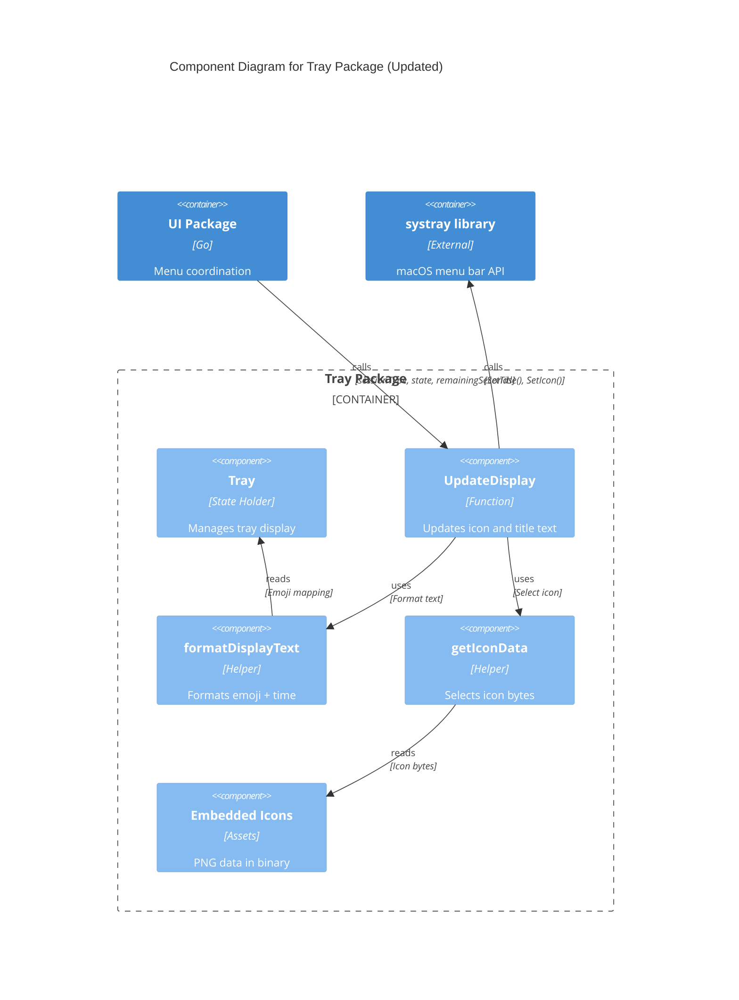
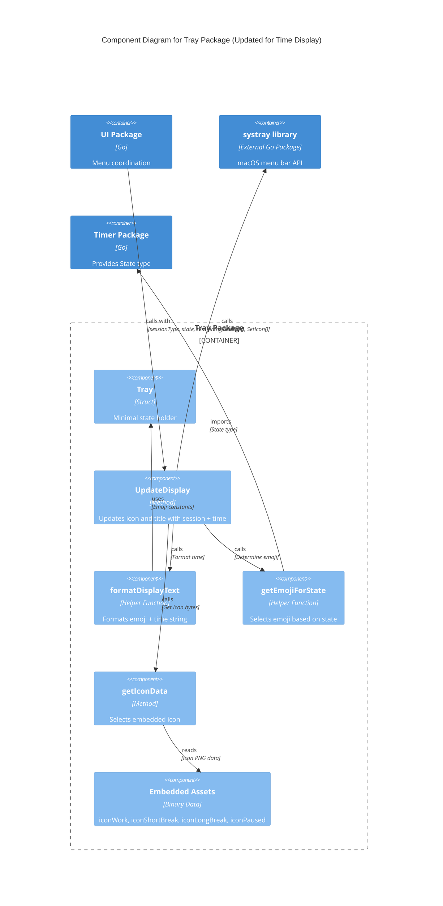

# Design: Tray Time Display with Session Icons

## Context and Problem

### Increment Goal

Users currently must click the tray icon and open the dropdown menu to see how much time remains in their pomodoro session. The tray displays only a static icon image without numeric time information. This design enables users to see remaining session time and session type at a glance in the menu bar without any interaction.

### Why This Change Now

After implementing the basic tray icon and dropdown UI, we have a functional timer system but poor time visibility. Users need to interrupt their focus to check remaining time, which defeats the purpose of a pomodoro timer that should help maintain focus.

### Current System Behavior

**Tray Package (`internal/tray/tray.go`):**
- Uses embedded PNG assets for different states (idle, work, short break, long break, paused)
- Provides `UpdateIcon(sessionType, state)` method that sets only the icon image
- Icon selection logic in `getIconData()` based on session type and timer state
- No text display in menu bar

**UI Package (`internal/ui/window.go`):**
- Manages dropdown menu with multiple items including `header` and `timerDisplay`
- Header shows current state (e.g., "🍅 Work Session", "Ready", "⏸️ Paused")
- Timer display shows countdown (e.g., "25min", "24min")
- Has `formatTime()` function returning "Xmin" format
- Calls `tray.UpdateIcon()` via `updateTrayIcon()` helper
- Updates header and timer display on every tick and state change

**Main Package (`cmd/gopomodoro/main.go`):**
- Sets static tooltip "GoPomodoro" after initialization
- No tray title configuration

**Timer Package (`internal/timer/timer.go`):**
- Ticks every 10 seconds (`tickInterval = 10 * time.Second`)
- Decrements remaining time by fixed 10 seconds per tick
- Fires tick callback with updated remaining time

### Links

- [increment.md](increment.md) - Product-level requirements
- [../../CONSTITUTION.md](../../CONSTITUTION.md) - Project values and principles (mode: lite)
- [../../ARCHITECTURE.md](../../ARCHITECTURE.md) - System architecture
- [../tray-icon-and-dropdown-ui/design.md](../tray-icon-and-dropdown-ui/design.md) - Prior tray design

## Proposed Solution (Technical Overview)

### High-Level Approach

Extend the tray package to display both icon and text in the menu bar using the systray library's `SetTitle()` API. Remove redundant header and timer display from the dropdown menu. Add timing verification to address user-reported perception that timers feel too long.

### Components Involved

**1. Tray Package (`internal/tray`):**
- Add new method `UpdateDisplay(sessionType, state, remainingSeconds)` 
- Combines icon update with title text update
- Formats emoji + time string (e.g., "🍅 24m")
- Changes idle state icon from neutral to tomato

**2. UI Package (`internal/ui`):**
- Remove `header` and `timerDisplay` menu item fields
- Modify `updateTrayIcon()` to pass remaining seconds
- Update all call sites to provide time information
- Change `formatTime()` from "Xmin" to "Xm" format
- Remove header/timer initialization from `InitializeMenu()`

**3. Main Package (`cmd/gopomodoro`):**
- Set initial tray title "🍅 25m" on startup

**4. Timer Package (`internal/timer`):**
- Add timing accuracy test to verify real-time duration matches expected duration
- No functional changes to timer logic

### Responsibilities After This Change

**Timer Package (domain logic - time management):**
- Maintain countdown state (remaining seconds)
- Tick at regular intervals (10 seconds)
- Fire events with raw time data (seconds as integers)
- **No formatting or display concerns**
- Verify timing accuracy through new test

**Tray Package (presentation - menu bar display):**
- Format session state for menu bar display (emoji + time)
- Convert raw seconds to user-friendly "Xm" format
- Select appropriate emoji based on session type/state
- Call systray library to update menu bar
- **Owns menu bar presentation logic**

**UI Package (coordination - dropdown display):**
- Coordinate between timer, session, and tray packages
- Format times for dropdown menu items (progress bar uses "Xm")
- Manage dropdown menu structure and button states
- Translate timer events into display updates
- **Owns dropdown presentation logic**

**Session Package (domain logic - cycle management):**
- No changes - continues to manage pomodoro cycle state
- Determine next session types
- Track completed sessions

### Clear Separation of Concerns

**Domain Logic (Timer, Session):**
- Pure business logic with no UI dependencies
- Work with raw data (integers, state enums)
- Can be tested without any display code

**Presentation Logic (Tray, UI):**
- Transform domain data into user-visible formats
- Own their specific formatting needs
- Depend on domain packages but not each other

### Typical Flow After Change

1. User launches app
2. Main sets tray icon and title: icon=🍅, title="🍅 25m"
3. User clicks Start
4. UI calls `tray.UpdateDisplay("work", StateRunning, 1500)`
5. Tray sets icon to work emoji, title to "🍅 25m"
6. Timer ticks every 10 seconds
7. UI receives tick callback with remaining seconds
8. UI calls `tray.UpdateDisplay("work", StateRunning, 1490)` 
9. Tray updates title to "🍅 24m" (1490 seconds = 24 minutes when rounded)
10. Cycle continues until completion
11. User sees countdown in menu bar without opening dropdown

## Scope and Non-Scope (Technical)

### In Scope

**Tray display changes:**
- Add text display capability to tray package
- Format emoji + time for menu bar title
- Change idle state icon from neutral to work emoji

**UI simplification:**
- Remove header menu item (struct field, initialization, all updates)
- Remove timer display menu item (struct field, initialization, all updates)
- Update tray call signature to include remaining seconds
- Modify formatTime() to use "m" suffix instead of "min"

**Startup configuration:**
- Set initial tray title on app launch

**Timing verification:**
- Add test to measure actual elapsed time vs expected duration
- Ensure 5-minute timer actually takes ~5 minutes in real time

### Out of Scope

**Not changing:**
- Timer tick interval (stays at 10 seconds)
- Timer countdown algorithm (still decrements by 10 per tick)
- Session durations or cycle logic
- Progress bar or cycle indicator display
- Button functionality
- Storage or logging

**Explicitly deferred:**
- Customizable time format (always "Xm")
- User preferences for tray display
- Seconds precision display
- Adaptive tick frequency
- Elapsed-time-based countdown (vs fixed decrements)
- Menu bar space overflow handling

### Architectural Fit

This change strengthens the separation between tray display (presentation) and timer logic (domain). The tray package gains responsibility for formatting user-visible time, which is appropriate for a UI boundary component. The UI package sheds duplicate state tracking, becoming simpler and more focused on coordination.

## Architecture and Boundaries

### Component Interactions
eparation of Concerns**
- Timer package: pure time logic, no formatting, no display
- Tray package: presentation for menu bar (formatting + display)
- UI package: presentation for dropdown (formatting + coordination)
- No shared formatting utilities - each presentation layer owns its format

**Principle: Simple Is Better Than Complex**
- Tray package stays thin, just formatting and displaying
- No complex state management in tray (state lives in timer/session)
- Single method call updates both icon and title atomically

**Principle: Small, Safe Steps**
- Add new tray method alongside existing one
- Remove menu items only after tray display works
- Can test each piece independently

**Principle: Make It Work, Make It Right**
- Start with basic formatting (minutes only, no special casing)
- Can refine format in follow-up if needed

**Dependency boundaries:**
- Timer/Session packages: no dependencies on UI packages (can be tested in isolation)
- Tray package: depends only on timer package (for State type) and systray library
- UI package: depends on timer, session, and tray (coordination layer)
- No circular dependencies
- Data flows one direction: Timer → UI → Tray → systray libraryay()` with all display info
5. Tray package formats emoji + time string
6. Tray package calls `systray.SetTitle()` and `systray.SetIcon()`
7. macOS menu bar displays updated icon and text

### Guardrails from Constitution

**Principle: Simple Is Better Than Complex**
- Tray package stays thin, just formatting and displaying
- No complex state management in tray (state lives in timer/session)
- Single method call updates both icon and title atomically

**Principle: Small, Safe Steps**
- Add new tray method alongside existing one
- Remove menu items only after tray display works
- Can test each piece independently

**Principle: Make It Work, Make It Right**
- Start with basic formatting (minutes only, no special casing)
- Can refine format in follow-up if needed

**Dependency boundaries:**
- Tray depends only on timer package (for State type) and systray library
- UI coordinates between tray, timer, and session
- No circular dependencies introduced

### Updated Component Diagram

The Tray package gains new responsibilities:



**Key change:** The `UpdateDisplay` method combines icon selection with title text formatting, taking remaining seconds as input and producing both visual elements for the menu bar.

## Contracts and Data

### External Library Interface

**systray library (unchanged contract, new usage):**

```go
// Existing - already in use
func systray.SetIcon(iconBytes []byte)

// Existing - new usage in this increment
func systray.SetTitle(title string) // Displays text in menu bar next to icon
```

**Contract expectations:**
- `SetTitle()` updates text immediately
- Empty string removes text (icon only)
- Text rendering controlled by macOS (font, size, color)
- Long text may be truncated by system

### Internal Package Interfaces

**Tray Package - New Method:**

```go
// UpdateDisplay updates both the tray icon and title text based on current state
func (t *Tray) UpdateDisplay(sessionType string, state timer.State, remainingSeconds int)
```

**Behavior:**
- Selects appropriate emoji based on sessionType and state
- Formats remaining seconds as "Xm" (e.g., 1500 → "25m", 300 → "5m")
- Calls `systray.SetIcon()` with appropriate embedded icon
- Calls `systray.SetTitle()` with formatted string (e.g., "🍅 24m")
- Idempotent - safe to call repeatedly with same values

**Emoji selection logic:**

| State | Session Type | Emoji | Icon |
|-------|-------------|-------|------|
| Idle | any | 🍅 | iconWork (changed from iconIdle) |
| Running | work | 🍅 | iconWork |
| Running | short_break | ☕ | iconShortBreak |
| Running | long_break | 🌟 | iconLongBreak |
| Paused | any | ⏸️ | iconPaused |

**Time formatting:**
- Input: remaining seconds (int)
- Output: "Xm" string where X is minutes, rounded down
- Examples: 1500s → "25m", 299s → "4m", 59s → "0m"

**UI Package - Modified Method:**

```go
// Before
func (w *Window) updateTrayIcon(state timer.State)

// After  
func (w *Window) updateTrayIcon(state timer.State, remainingSeconds int)
```

**Behavior change:**
- Now calls `tray.UpdateDisplay()` instead of `tray.UpdateIcon()`
- Passes remaining seconds from timer state
- Called from same locations (button handlers, timer callbacks, state updates)

**UI Package - Modified Helper:**

```go
// Before
func formatTime(seconds int) string {
    minutes := seconds / 60
    return fmt.Sprintf("%dmin", minutes)
}

// After
func formatTime(seconds int) string {
    minutes := seconds / 60
    return fmt.Sprintf("%dm", minutes)
}
```

**Behavior change:**
- Returns "24m" instead of "24min"
- Used only for progress bar text (now that timer display is removed)

**UI Package - Removed Fields:**

```go
// These fields will be removed from Window struct:
header           *systray.MenuItem  // Remove
timerDisplay     *systray.MenuItem  // Remove
// These remain:
progressBar      *systray.MenuItem  // Keep
cycleIndicator   *systray.MenuItem  // Keep
btnStart         *systray.MenuItem  // Keep
// ... other buttons ...
```

### Compatibility Considerations

**No breaking changes:**
- External API unchanged (systray library usage only)
- Timer tick behavior unchanged
- Session logic unchanged
- Storage format unchanged

**Internal API changes:**
- `updateTrayIcon()` signature change is internal to ui package
- All call sites within same package, updated together
- No other packages call this method

**Migration st (presentation layer):**

Test emoji selection logic (presentation concern):
- Idle state → returns 🍅 with iconWork
- Running work session → returns 🍅 with iconWork  
- Running short break → returns ☕ with iconShortBreak
- Running long break → returns 🌟 with iconLongBreak
- Paused state → returns ⏸️ with iconPaused

Test time formatting for menu bar display (presentation concern):
- 1500 seconds → "25m"
- 300 seconds → "5m"
- 900 seconds → "15m"
- 60 seconds → "1m"
- 30 seconds → "0m"
- 0 seconds → "0m"

**UI Package (presentation layer):**

Test formatTime() function for dropdown display (presentation concern):
- Returns "Xm" format instead of "Xmin"
- Handles zero correctly
- Rounds down fractional minutes

Verify updateTrayIcon() signature (coordination concern):
- Accepts state and remainingSeconds (raw domain data)
- Passes domain data to tray presentation layer
- Can be compiled and called from all existing call sites

**Timer Package (domain layer):**

Test timing accuracy (domain concern):
- 60-second countdown completes in ~60 real seconds
- Verifies core time management logic
- No display or formatting tests here
Test formatTime() function:
- Returns "Xm" format instead of "Xmin"
- Handles zero correctly
- Rounds down fractional minutes

Verify updateTrayIcon() signature:
- Accepts state and remainingSeconds
- Can be compiled and called from all existing call sites

**Timer Package (NEW):**

Test timing accuracy:
- Start 60-second timer and measure actual elapsed time
- Verify completion happens within 60 ± 2 seconds (allowing for scheduling variance)
- Use real time.Now() measurement around Start() and completion callback
- Helps diagnose if perceived slowness is real timing drift or just UX perception

Example test structure:
```go
func TestTimingAccuracy(t *testing.T) {
    tmr := New()
    
    completed := make(chan time.Time, 1)
    tmr.OnCompleted(func() {
        completed <- time.Now()
    })
    
    startTime := time.Now()
    tmr.Start("work", 60) // 60 second timer
    
    completionTime := <-completed
    elapsed := completionTime.Sub(startTime).Seconds()
    
    // Should complete within 60 ± 2 seconds
    if elapsed < 58 || elapsed > 62 {
        t.Errorf("Expected ~60s, got %.2fs", elapsed)
    }
}
```

### Integration Testing

**Manual flow test:**

1. Build and launch app
2. Verify tray shows "🍅 25m" (tomato + default work duration)
3. Open dropdown, verify progress bar is first item (no header above it)
4. Verify no timer display item in dropdown
5. Click Start
6. Observe tray updates to "🍅 24m" after first tick (~10 seconds)
7. Let timer run for 1 minute, verify tray shows "🍅 23m"
8. Click Pause
9. Verify tray shows "⏸️ 23m" and stops updating
10. Click Resume (Start)
11. Verify tray shows "🍅 23m" and resumes countdown
12. Let work session complete
13. Verify tray shows "☕ 5m" (short break)
14. **Use stopwatch: time the 5-minute break to verify it takes ~5 real minutes**
15. Complete 4 work sessions
16. Verify tray shows "🌟 15m" (long break)
17. Click Reset during any session
18. Verify tray returns to "🍅 25m"

**Regression checks:**
- Progress bar still animates during sessions
- Cycle indicator still shows correct session count
- All buttons still work (Start, Pause, Reset, Skip, Quit)
- Session logging still records events

### Test Data and Fixtures

**No special fixtures needed:**
- Emoji characters are literals in code
- Icon assets are embedded in binary
- Test durations can be short (30-60 seconds) for faster testing

**Potential flakiness:**
- Timing test depends on system scheduling (allow 2-second tolerance)
- Manual testing requires human observation (use stopwatch for objectivity)

### Safety Net Summary

For lite mode, the safety net focuses on:
- Essential unit tests for formatting and state logic
- One timing accuracy test to verify perceived issue
- Manual integration test covering full user flow
- Visual verification that tray displays correctly

This is sufficient for a single-developer project with no production dependencies.

## CI/CD and Rollout

### CI Implications

**Existing pipeline:**
- `make build` - compiles binary
- `make test` - runs all unit tests
- No CI automation currently (lite mode)

**Changes needed:**
- None - new tests run automatically with `make test`
- Build process unchanged (embedded assets already supported)

**Verification:**
- Run `make test` locally before commit
- Verify `make build` produces working binary
- Manual smoke test after build

### Rollout Plan

**Development build:**
1. Make code changes
2. Run `make test` to verify unit tests
3. Run `make build` to compile
4. Run `./bin/gopomodoro` to test manually
5. Use stopwatch to verify 5-minute timer actually takes 5 minutes

**Installation:**
1. Run `make install` to copy to /usr/local/bin
2. Launch from anywhere with `gopomodoro`
3. Verify tray display works in real usage

**No staged rollout needed:**
- Single-user application
- No server component
- No data migration
- Changes are UI-only and immediately visible

### Rollback Plan

**If tray display has issues:**
- Simple git revert of changes
- Run `make build && make install` to restore previous version
- User can continue using app with old dropdown-based time display

**If timing issue persists:**
- Timing test will provide data to diagnose issue
- Can adjust tick interval or countdown algorithm in follow-up increment
- Tray display changes are independent of timer logic

**No complex rollback needed:**
- No database schema changes
- No file format changes
- No persistent state affected
- Reverting code fully restores previous behavior

## Observability and Operations

### Logging

**No new logging required:**
- Existing timer logs (start, pause, resume, reset, complete) remain
- Previously removed excessive icon update logging
- Tray title updates are visual and don't need logging

**Existing logs to observe:**
```
[INFO] Tray initialization called
[INFO] Timer created
[INFO] Timer wired to UI
[INFO] Button states initialized
```

**Debug approach:**
- Visual inspection of tray title
- Check timer logs for state transitions
- Use stopwatch to verify real-time duration

### Metrics

**Not applicable for lite mode:**
- No metrics collection infrastructure
- No analytics or telemetry
- Single-user desktop app with no server component

### Alerts and Dashboards

**Not applicable for lite mode:**
- No monitoring infrastructure
- User observes app behavior directly
- Issues visible immediately in UI

### Operational Considerations

**Resource usage:**
- No change expected (just adding one string update per tick)
- Tick interval unchanged (10 seconds)
- No additional memory allocation (emoji are string literals)

**Known operational risks:**
- None - purely local UI changes
- No network dependencies
- No file system changes at runtime

**User-visible issues:**
- Emoji may render differently across macOS versions (acceptable for lite mode)
- Long text might be truncated on small displays (acceptable - can refine later)
- 10-second tick interval means tray updates only every 10 seconds (current behavior)

### Observability Summary

For lite mode, observability is:
- Visual inspection of tray display during manual testing
- Existing timer logs for state transitions
- Stopwatch verification for timing accuracy
- No automated monitoring or metrics needed

## Risks, Trade-offs, and Alternatives

### Known Risks

**Technical risks:**

1. **Emoji rendering variance**
   - Risk: 🍅☕🌟⏸️ may look different on older macOS versions
   - Impact: Low - emoji are widely supported on macOS
   - Mitigation: Test on current macOS version, accept variance as cosmetic

2. **Menu bar space constraints**
   - Risk: "🍅 25m" might be truncated on small displays with many menu bar items
   - Impact: Medium - could hide time information
   - Mitigation: Accept for now, can add auto-shortening in follow-up

3. **Timing perception issue**
   - Risk: Timer might actually be slow due to fixed 10-second decrements
   - Impact: Medium - affects user trust in timer accuracy
   - Mitigation: Add timing accuracy test to measure real elapsed time

4. **Update frequency feels sluggish**
   - Risk: 10-second tick interval means tray only updates every 10 seconds
   - Impact: Low - functional but less smooth than 1-second updates
   - Mitigation: Acceptable for lite mode, can increase frequency in follow-up

**Operational risks:**
- None - no deployment complexity, rollback is simple revert

### Trade-offs

**Time format: "Xm" vs "XX:XX"**

Chose "Xm" because:
- Saves menu bar space (important on small displays)
- Matches common notation (25m, 5m)
- Sufficient precision for pomodoro technique (minutes, not seconds)

Rejected "XX:XX" because:
- Takes more space
- Implies seconds precision we don't show
- More visual clutter

**Tick interval: Keep at 10 seconds**

Chose to keep current 10-second interval because:
- Already implemented and tested
- Battery/CPU efficient
- Sufficient for pomodoro technique (minute-level tracking)

Could change to 1-second because:
- Smoother countdown display
- More responsive to user actions
- Better perceived accuracy

Decision: Keep at 10 seconds for this increment, can adjust in follow-up if timing test shows drift or user feedback requests smoother updates.

**Icon for idle state: Tomato vs neutral**

Chose tomato (🍅) because:
- Signals "ready to start work session"
- Consistent with PRD vision
- More engaging than gray circle

Rejected neutral/gray because:
- Less clear what app is for
- Misses opportunity to communicate state

**Tray title format: Icon + time vs time only vs icon only**

Chose icon + time because:
- Best of both worlds (visual + numeric)
- Icon provides context, time provides precision
- Matches PRD wireframes

Rejected time-only because:
- Loses visual session type indication
- Harder to distinguish work from break

Rejected icon-only because:
- No time visibility (defeats the increment goal)

### Alternatives Considered

**Alternative 1: Keep header and timer in dropdown, just add tray display**

Pros:
- Less code change
- Redundancy might help some users
- Gradual transition

Cons:
- More cluttered UI
- Duplicate state maintenance
- Against "simple is better" principle

Rejected because increment explicitly calls for removing redundant items.

**Alternative 2: Use tooltip instead of title for time display**

Pros:
- Cleaner menu bar (icon only)
- No truncation risk

Cons:
- Requires hover to see time (defeats "glanceable" goal)
- Tooltip might not update dynamically

Rejected because time needs to be always visible without interaction.

**Alternative 3: Implement seconds precision in tray display**

Pros:
- More accurate feeling
- Could justify 1-second tick interval

Cons:
- Takes more space ("🍅 24m 37s" vs "🍅 24m")
- More visual noise
- Pomodoro doesn't need second precision

Rejected as out of scope (non-goal in increment).

### When to Revisit

**Reconsider 1-second ticks if:**
- Timing test reveals significant drift (>5% error)
- Multiple users report timer feels inaccurate
- Battery impact proves negligible

**Reconsider time format if:**
- Users report menu bar truncation issues
- Desire for seconds precision emerges
- Localization needs arise (e.g., different cultures prefer different formats)

**Reconsider tray display customization if:**
- Users want to toggle tray text on/off
- Different preferences emerge for format
- Accessibility concerns arise

## Follow-up Work

### Potential Future Increments

**Timing improvements:**
- Increase tick interval to 1 second for smoother countdown
- Change countdown algorithm to use elapsed time measurement instead of fixed decrements
- Reduces drift, improves perceived accuracy

**Display customization:**
- Add user preference for tray format (icon only, time only, icon+time)
- Support seconds precision as optional display mode
- Allow toggling tray display entirely

**Menu bar space optimization:**
- Detect available menu bar space
- Auto-shorten to "🍅" when space is constrained
- Expand to "🍅 24m" when space allows

**Enhanced timing verification:**
- Add continuous timing accuracy monitoring
- Log drift statistics to help diagnose issues
- Alert if timer consistently runs too fast/slow

### Tech Debt and Clean-up

**After this increment:**
- Consider refactoring formatTime() to shared utility if used in multiple places
- May want to extract emoji mapping to constants if reused
- Could consolidate tray update call sites if pattern becomes repetitive

**Not blocking this increment:**
- Current approach is simple and maintainable
- Premature abstraction avoided per constitution
- Can refactor later if duplication emerges

### Monitoring and Validation

**Post-rollout validation:**
- Use app normally for 1-2 full pomodoro cycles
- Time several breaks with stopwatch to verify accuracy
- Observe tray display across different session types
- Verify menu looks clean without header/timer

**Success criteria:**
- Tray shows correct emoji for each session type
- Time counts down visibly (updates every 10 seconds)
- 5-minute break measured with stopwatch takes 5 ± 0.2 minutes
- Dropdown menu is simpler and less cluttered
- No crashes or visual glitches

## References

- [increment.md](increment.md) - Product requirements for this increment
- [../../CONSTITUTION.md](../../CONSTITUTION.md) - Project principles (mode: lite)
- [../../ARCHITECTURE.md](../../ARCHITECTURE.md) - System architecture and C4 diagrams
- [../../PRD.md](../../PRD.md) - Product requirements document with tray UI specifications
- [../tray-icon-and-dropdown-ui/design.md](../tray-icon-and-dropdown-ui/design.md) - Original tray icon design
- [../visual-feedback-with-progress-indicators/design.md](../visual-feedback-with-progress-indicators/design.md) - Progress bar design

## Machine-Readable Artifacts

### Updated C4 Component Diagram for Tray Package

This diagram updates the Tray Package component view to reflect the new `UpdateDisplay` method and its interaction with the systray library:



### Function Signatures (Go Interface Definitions)

**Tray Package - New Public Method:**

```go
// UpdateDisplay updates both the tray icon and menu bar title to reflect
// current session state and remaining time.
//
// sessionType should be one of: "work", "short_break", "long_break"
// state should be timer.StateIdl (presentation logic):**

```go
// formatDisplayText converts session info to menu bar display string
// This is presentation logic specific to menu bar display
func formatDisplayText(emoji string, remainingSeconds int) string

// getEmojiForState selects the appropriate emoji based on session type and state
// This is presentation logic specific to menu bar display
func getEmojiForState(sessionType string, state timer.State) string

// formatMinutes converts raw seconds to minute string for menu bar
// Internal to tray package - owns its display format
func formatMinutes(seconds int) string
```

**UI Package - Modified Internal Method:**

```go
// updateTrayIcon updates the tray display with current state and remaining time
// (previously only took state parameter)
// This is coordination logic - passes domain data to presentation layer
func (w *Window) updateTrayIcon(state timer.State, remainingSeconds int)
```

**UI Package - Modified Helper (presentation logic):**

```go
// formatTime converts seconds to concise minute format for dropdown menu display
// Examples: 1500 → "25m", 300 → "5m", 59 → "0m"
// Internal to UI package - owns its display format (may differ from tray if needed)
func formatTime(seconds int) string
```

**Timer Package - No Formatting Functions:**

```go
// Timer package provides only domain logic methods:
// GetRemaining() int - returns raw seconds (no formatting)
// GetState() State - returns state enum
// No display, formatting, or presentation concernste timer.State, remainingSeconds int)
```

**UI Package - Modified Helper:**

```go
// formatTime converts seconds to concise minute format
// Examples: 1500 → "25m", 300 → "5m", 59 → "0m"
func formatTime(seconds int) string
```

### Emoji Constants

```go
// In tray package - emoji mappings for display

const (
    emojiWork      = "🍅"  // Tomato - work session
    emojiBreak     = "☕"  // Coffee - short break
    emojiLongBreak = "🌟"  // Star - long break  
    emojiPaused    = "⏸️"  // Pause symbol - paused state
    emojiIdle      = "🍅"  // Tomato - idle/ready (changed from neutral)
)
```

### Time Format Examples

```go
// Input/Output examples for formatDisplayText

formatDisplayText("🍅", 1500) → "🍅 25m"  // 25 minutes work
formatDisplayText("☕", 300)  → "☕ 5m"   // 5 minutes short break
formatDisplayText("🌟", 900)  → "🌟 15m"  // 15 minutes long break
formatDisplayText("⏸️", 742)  → "⏸️ 12m"  // 12 minutes paused (742 seconds)
formatDisplayText("🍅", 59)   → "🍅 0m"   // Less than 1 minute rounds to 0
formatDisplayText("🍅", 0)    → "🍅 0m"   // Zero time
```

These machine-readable artifacts can be used by implementation tooling to generate boilerplate code or validate the implementation against the design.
